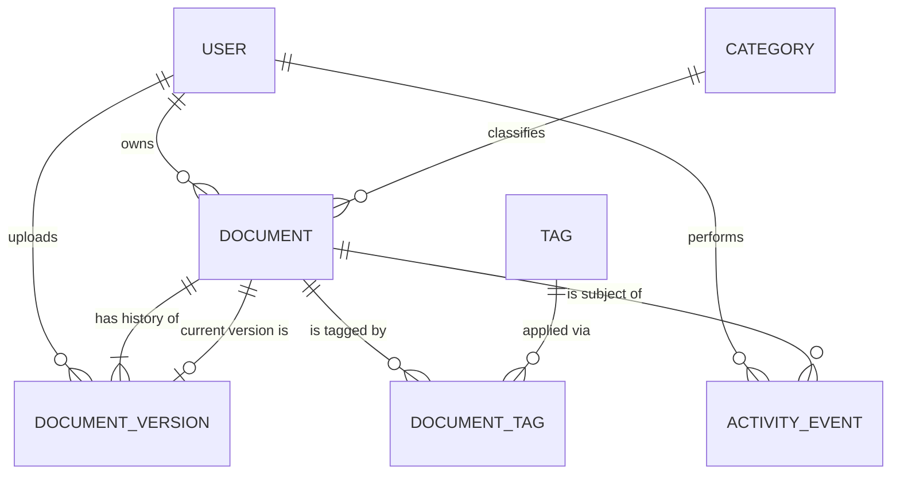

# DocBrain — Software Architecture & Implementation Plan

**Document type:** Solution architecture document (pre-implementation)
**Status:** Final planning draft — *no code has been written*
**Scope:** Ahmedabad AI Hackathon #5 — "Smart Document Manager" problem statement, Phase 1 only
**Last updated:** 2026-07-23 (backend tooling: added `uv`)

This document supersedes [PHASE-1-ARCHITECTURE.md](PHASE-1-ARCHITECTURE.md) (which explored a Spring
Boot/Java stack). It reflects the **finalized technology decisions** below and is scoped strictly to the
official hackathon brief — no AI features, no scope beyond what the problem statement and ground rules
call for.

## Official brief (recap, for traceability)

> Project and team documents are scattered across emails, chat threads, shared drives and folders. Teams
> can't find documents, there's no standard naming, no way to know the latest version, no version
> tracking, no review reminders, and no centralized dashboard.

**Where to start (from the slide):** upload documents named/tagged by category · keyword and tag-based
search · version history showing when a file was last updated and by whom · a dashboard of recently added,
recently accessed, and expiring documents.

**Ground rules:** no external LLM API keys (Claude/GHCP/any LLM tool is fine, but nothing paid/external) ·
no third-party submission tools · local/mock data.

## Finalized technology stack

| Layer | Choice | Notes |
|---|---|---|
| Frontend | Next.js (App Router) + TypeScript + Tailwind CSS + shadcn/ui | Deployed to Vercel |
| Backend | Python 3.11+ / FastAPI | Runs locally during development |
| Backend tooling | [uv](https://github.com/astral-sh/uv) | Package installs, virtual env, and dependency locking — replaces `pip`/`venv` |
| Database | Supabase Postgres (free tier) | Used purely as hosted Postgres — accessed directly via SQLAlchemy, not via Supabase's auto-REST or client SDK (see [§9.4](#94-why-we-do-not-use-the-supabase-client-sdk)) |
| Storage | Local filesystem (`uploads/` folder on the backend host) | Explicitly **not** Supabase Storage |
| Auth | Simple/mock authentication | Real token mechanics, mocked identity source (see [§3](#3-user-roles)) |
| Deployment | Frontend → Vercel; backend → local | See [§19.7](#197-a-note-on-the-splitdeployment-topology) for the practical implication of this split |

---

## Table of Contents

1. [Product Understanding](#1-product-understanding)
2. [Feature Breakdown](#2-feature-breakdown)
3. [User Roles](#3-user-roles)
4. [User Journeys](#4-user-journeys)
5. [Information Architecture](#5-information-architecture)
6. [Complete Screen Planning](#6-complete-screen-planning)
7. [Database Planning](#7-database-planning)
8. [API Planning](#8-api-planning)
9. [Backend Architecture](#9-backend-architecture)
10. [Frontend Architecture](#10-frontend-architecture)
11. [Database Workflow](#11-database-workflow)
12. [File Upload Workflow](#12-file-upload-workflow)
13. [Search Workflow](#13-search-workflow)
14. [Version History Workflow](#14-version-history-workflow)
15. [Dashboard Planning](#15-dashboard-planning)
16. [Error Handling Strategy](#16-error-handling-strategy)
17. [Security Planning](#17-security-planning)
18. [Performance Planning](#18-performance-planning)
19. [Development Roadmap](#19-development-roadmap)
20. [Future Expansion](#20-future-expansion)

---

# 1. Product Understanding

## 1.1 Problem statement analysis

Documents are produced collaboratively but stored accidentally — wherever the last person touched them:
an email attachment, a chat thread, a shared drive, a laptop's Downloads folder. Nobody has one place to
look, so the same six failures recur in every team:

| Symptom (from the brief) | Root cause |
|---|---|
| Difficult to locate documents | No single index; retrieval depends on remembering *where*, not *what* |
| No standard naming | Naming is a free-text decision made per person at save time, with no system enforcing it |
| Difficult to know latest version | "Version" lives in the filename (`final_v2_USE_THIS.docx`), not in a system |
| No version tracking | Files are overwritten in place; prior states are simply gone |
| No review reminders | Documents are treated as one-time deliverables, not assets with a lifecycle |
| No centralized dashboard | No system owns the corpus, so nobody can see its health |

## 1.2 Objectives

1. Give every document **one home, one owner, one category, and an unmistakable current version**.
2. Make categorisation and tagging **mandatory at the point of upload**, not optional metadata added later.
3. Make version history **system-owned and immutable** — a re-upload is a new version, never an overwrite.
4. Make documents **findable in seconds** via keyword search, category, and tag filters.
5. Give team leads and reviewers a **dashboard** that shows what exists, what's new, and what needs review.
6. Ship a **working, polished MVP** end-to-end — narrow scope, but nothing half-built.

## 1.3 User pain points

| Persona | Pain today |
|---|---|
| Employee | Doesn't know where a new document "should" go; can't tell which of four similarly-named files is current; loses track of their own uploads |
| Reviewer | Has no queue of documents awaiting review; discovers a stale/expired document only after it's already been used |
| Admin | Cannot see the shape of the corpus — what exists, what's uncategorised, what's overdue for review |

## 1.4 Proposed solution

A focused, single-purpose document workspace — not a general file-sync tool, not a wiki — built around
three enforced disciplines:

- **Mandatory metadata at ingestion**: every upload requires a title and a category; tags are
  encouraged via autocomplete.
- **System-owned versioning**: the document is a stable logical entity; each upload against it appends a
  new version. The "current version" pointer is a database fact, not a filename convention.
- **A dashboard that is a workflow, not a poster**: every widget (recent uploads, expiring documents,
  pending reviews) links into a filtered document list, so it's something you act on, not just look at.

## 1.5 Success criteria

| Criterion | How it's verified |
|---|---|
| A document can be found by keyword, category, or tag in under a few seconds | Manual test against ~40–60 seeded documents |
| Re-uploading a file never destroys the previous version | Upload v2, confirm v1 is still downloadable with its original content intact |
| "Current version" is unambiguous everywhere the document appears | Same version number shown on explorer, details page, and dashboard |
| The dashboard reflects real corpus state | KPIs and widgets match the seeded data exactly |
| The full loop works live in a demo | Login → upload → tag → search → view → new version → dashboard updates |

---

# 2. Feature Breakdown

Modules, in the order a user would encounter them. Each has purpose, user actions, data involved, and
dependencies on other modules.

## 2.1 Auth (mock login)

| | |
|---|---|
| **Purpose** | Establish which seeded user is acting, so ownership, permissions and the audit trail all mean something |
| **User actions** | Pick a seeded persona or type an email → sign in; sign out |
| **Data involved** | `users` table |
| **Dependencies** | None — every other module depends on this |

## 2.2 Dashboard

| | |
|---|---|
| **Purpose** | Turn the document corpus into a decision surface: what exists, what's new, what needs attention |
| **User actions** | View KPIs; click any widget to jump into a pre-filtered document list |
| **Data involved** | Aggregates over `documents`, `document_versions`, `categories`, `reviews` |
| **Dependencies** | Document Listing (drill-through target), Reviews |

## 2.3 Document Upload

| | |
|---|---|
| **Purpose** | The single governed entry point into the corpus — makes good metadata the path of least resistance |
| **User actions** | Select file → fill title/category/tags/description → submit; or upload a new version against an existing document |
| **Data involved** | `documents`, `document_versions`, `categories`, `tags`, `document_tags` |
| **Dependencies** | Categories & Tags (for the picker), Version History (creates version 1) |

## 2.4 Document Listing (Explorer)

| | |
|---|---|
| **Purpose** | Browse, filter and act on the corpus |
| **User actions** | Filter by category/tag/owner/type/date/review status; sort; paginate; open a document; bulk actions |
| **Data involved** | `documents` joined with `categories`, `document_tags`→`tags`, `users`, current `document_versions` row |
| **Dependencies** | Search (shares the same query engine), Categories & Tags |

## 2.5 Search

| | |
|---|---|
| **Purpose** | Turn a remembered keyword into a result, ranked by relevance |
| **User actions** | Type a keyword in the global search bar or the explorer search field; refine with filters |
| **Data involved** | `documents.search_vector` (Postgres full-text index) |
| **Dependencies** | Document Listing (renders results in the same UI) |

## 2.6 Document Details

| | |
|---|---|
| **Purpose** | The canonical page for one document — metadata, current version, history, review status |
| **User actions** | Download; upload a new version; edit metadata; view version history; mark reviewed (Reviewer/Admin) |
| **Data involved** | `documents`, current `document_versions` row, `document_tags` |
| **Dependencies** | Version History, Reviews |

## 2.7 Version History

| | |
|---|---|
| **Purpose** | Make the document's lifecycle legible and reversible — the direct answer to "no version tracking" |
| **User actions** | View all versions with uploader/date/change note; download any version; restore an older version |
| **Data involved** | `document_versions` (append-only) |
| **Dependencies** | Document Upload (creates versions), Storage |

## 2.8 Categories & Tags (Taxonomy)

| | |
|---|---|
| **Purpose** | Keep the organizing vocabulary controlled — directly addresses "no standard naming" |
| **User actions** | (Admin) create/rename/archive categories; rename/merge tags. (All users) pick from the list when uploading |
| **Data involved** | `categories`, `tags`, `document_tags` |
| **Dependencies** | None — feeds Upload, Listing, Search |

## 2.9 Reviews

| | |
|---|---|
| **Purpose** | Attach a lifecycle to documents — the visibility half of "no review reminders" |
| **User actions** | Set a review-due date on a document; Reviewer sees a "Pending Reviews" queue; marks a document reviewed, which resets the due date |
| **Data involved** | `documents.review_due_date`, `documents.last_reviewed_at`, `documents.last_reviewed_by` |
| **Dependencies** | Document Details, Dashboard |

## 2.10 Trash

| | |
|---|---|
| **Purpose** | Safe, reversible deletion — nothing is ever silently lost |
| **User actions** | Delete (soft) a document; restore it; Admin permanently deletes |
| **Data involved** | `documents.status`, `deleted_at`, `deleted_by` |
| **Dependencies** | Document Listing |

## 2.11 Settings

| | |
|---|---|
| **Purpose** | Minimal personal preferences | 
| **User actions** | Toggle theme; set default page size |
| **Data involved** | `user_preferences` |
| **Dependencies** | Auth |

---

# 3. User Roles

Three roles, matching the hackathon's implied need for both contributors and a governance/oversight
function. Roles are **seeded**, not managed through UI (managing roles is out of scope — see [§20](#20-future-expansion)),
but permission enforcement itself is real and happens server-side on every request, not just hidden in
the UI.

## 3.1 Admin

**Who:** Owns the health of the whole document corpus (analogous to a knowledge-management/ops owner).

| Permission | Detail |
|---|---|
| Full read/write on all documents | Including changing category, tags, owner |
| Manage categories | Create, rename, archive |
| Manage tags | Rename, merge duplicates |
| Permanently delete | From Trash only, after soft delete |
| View all activity/audit history | Across every document |
| Everything an Employee and Reviewer can do | — |

## 3.2 Employee

**Who:** Individual contributor — the primary producer and consumer of documents.

| Permission | Detail |
|---|---|
| Upload new documents | With mandatory category, optional tags |
| Upload new versions | Of documents they own |
| Edit metadata | Of documents they own |
| Read | All non-deleted documents |
| Search & filter | Full access |
| Soft-delete | Own documents only |
| Cannot | Manage categories/tags, mark documents reviewed, edit others' documents, permanently delete |

## 3.3 Reviewer

**Who:** Responsible for confirming documents are current and accurate — the human half of the review
lifecycle (system provides visibility; the Reviewer provides judgment).

| Permission | Detail |
|---|---|
| Everything an Employee can do | — |
| View the Pending Reviews queue | All documents with a due or overdue review date |
| Mark a document as reviewed | Updates `last_reviewed_at`/`last_reviewed_by`, resets `review_due_date` per the category's review period |
| Edit metadata on any document | Needed to fix miscategorisation found during review |
| Cannot | Manage categories/tags, permanently delete, reassign ownership |

## 3.4 Permission matrix

| Capability | Employee | Reviewer | Admin |
|---|:--:|:--:|:--:|
| View dashboard | ✅ | ✅ | ✅ |
| Browse & search | ✅ | ✅ | ✅ |
| Upload new document | ✅ | ✅ | ✅ |
| Upload new version — own doc | ✅ | ✅ | ✅ |
| Upload new version — any doc | ❌ | ✅ | ✅ |
| Edit metadata — own doc | ✅ | ✅ | ✅ |
| Edit metadata — any doc | ❌ | ✅ | ✅ |
| Mark document reviewed | ❌ | ✅ | ✅ |
| View pending-reviews queue | ❌ | ✅ | ✅ |
| Soft-delete — own doc | ✅ | ✅ | ✅ |
| Soft-delete — any doc | ❌ | ❌ | ✅ |
| Restore from Trash | own only | own only | ✅ |
| Permanently delete | ❌ | ❌ | ✅ |
| Manage categories | ❌ | ❌ | ✅ |
| Rename/merge tags | ❌ | ❌ | ✅ |

> **Enforcement rule:** the UI hides actions a user cannot perform, but the **FastAPI service layer
> independently re-checks permission on every mutating endpoint**. UI-only authorisation is treated as a
> defect.

---

# 4. User Journeys

## 4.1 Journey map

```
                         ┌─────────────────────────┐
                         │      LOGIN (mock)        │
                         └────────────┬─────────────┘
                                     ▼
                         ┌─────────────────────────┐
                         │        DASHBOARD         │
                         │  KPIs · Widgets · Recent │
                         └──┬───────┬──────┬───────┬┘
                            │       │      │       │
                  ┌─────────┘       │      │       └─────────┐
                  ▼                 ▼      ▼                 ▼
           ┌─────────────┐  ┌──────────────┐         ┌────────────────┐
           │   UPLOAD     │  │   EXPLORER   │         │ PENDING REVIEWS │
           │              │  │  (+ search)  │         │ (Reviewer/Admin)│
           └──────┬───────┘  └──────┬───────┘         └────────┬───────┘
                  │                 │                          │
                  └────────┬────────┴──────────┬───────────────┘
                          ▼                    ▼
                 ┌──────────────────────────────────┐
                 │        DOCUMENT DETAILS           │
                 │  Overview │ Versions │ Activity    │
                 └───┬───────────┬──────────────┬─────┘
                     │           │              │
                     ▼           ▼              ▼
             ┌─────────────┐ ┌─────────┐ ┌──────────────┐
             │ NEW VERSION │ │ EDIT    │ │ MARK REVIEWED │
             └─────────────┘ │ METADATA│ └──────────────┘
                             └─────────┘
```

## 4.2 J1 — Login

```
Open app → not authenticated → redirect to /login (?next= preserved)
   ↓
Pick a seeded persona (Employee / Reviewer / Admin) or type an email
   ↓
Submit → FastAPI issues a signed token → set as httpOnly cookie
   ↓
Redirect to ?next= or / (Dashboard)
```

## 4.3 J2 — Upload → Categorize → Search → View → Update Version → Dashboard Refresh

*(the canonical loop requested in the brief, expanded to its full detail)*

```
Dashboard → [+ Upload]
   ↓
Select file (drag-drop or browse) — client checks type/size instantly
   ↓
Fill metadata: Title (pre-filled from filename) · Category* (required, curated list)
                · Tags (autocomplete) · Description (optional)
   ↓
Submit → progress bar → backend validates, stores file, creates Document + Version 1
   ↓
Toast: "«Title» uploaded (v1)" → [View document]
   ↓
Later: search for it by keyword in the topbar search
   ↓
Result appears, ranked, with the matched term highlighted → click through
   ↓
DOCUMENT DETAILS: review metadata, preview/download, see version = v1
   ↓
[Upload new version] → select updated file → mandatory "what changed?" note
   ↓
Submit → Version 2 created, becomes current; v1 preserved, still downloadable
   ↓
Return to Dashboard → "Recently updated" and KPIs reflect the new version immediately
```

## 4.4 J3 — Find a document

```
(a) Topbar search box     → type → debounced query → ranked results
(b) Sidebar → Documents   → explorer with filter rail (category/tag/owner/type/date/review)
(c) Dashboard widget click → pre-filtered explorer (e.g. "Expiring in 30 days")
        ↓
Refine filters / sort → click a row → Document Details
```

## 4.5 J4 — Reviewer clears the review queue

```
Login as Reviewer → Dashboard shows "Pending Reviews: 8"
   ↓
Click widget → Explorer pre-filtered to review status = Due/Overdue
   ↓
Open a document → confirm it's current/accurate → [Mark as reviewed]
   ↓
review_due_date resets per the category's review period; document drops off the queue
   ↓
Dashboard widget count decreases
```

## 4.6 J5 — Restore a previous version

```
Document Details → Versions tab → select v2 (current is v5)
   ↓
[Restore this version] → confirmation: "Creates version 6 with v2's content.
                          Versions 1–5 remain untouched and downloadable."
   ↓
Confirm → Version 6 created, becomes current
   ↓
History shows "v6 — restored from v2"
```

## 4.7 J6 — Delete and restore

```
Document Details or Explorer row → [Delete] → confirm
   ↓
Soft delete: hidden from listing/search/dashboard; file retained on disk
   ↓
Sidebar → Trash → [Restore] → document reappears exactly as it was
                 → [Delete permanently] (Admin only, double-confirm)
```

---

# 5. Information Architecture

## 5.1 Navigation shell

```
┌──────────────────────────────────────────────────────────────────────┐
│ TOPBAR: ☰  ⬢ DocBrain   [🔍 Search documents…]   [+ Upload]  👤 Priya │
├───────────────┬────────────────────────────────────────────────────────┤
│ SIDEBAR        │ Breadcrumb: Dashboard / Documents / SOW — Acme         │
│                │ ─────────────────────────────────────────────────      │
│ ▪ Dashboard    │                                                        │
│ ▪ Documents    │                                                        │
│ ▪ My Documents │                    PAGE CONTENT                        │
│ ▪ Pending      │                                                        │
│   Reviews      │                                                        │
│ ▪ Trash        │                                                        │
│                │                                                        │
│ ── Admin ──    │  (Admin only)                                          │
│ ▪ Categories   │                                                        │
│ ▪ Tags         │                                                        │
│                │                                                        │
│ ⚙ Settings     │                                                        │
└───────────────┴────────────────────────────────────────────────────────┘
```

**Why this shape:**
- **Sidebar groups by mental model, not by data model.** "My Documents" and "Pending Reviews" are *saved
  filtered views* of the same Explorer, not separate screens — one implementation, several entry points.
- **Search lives in the topbar, globally**, because "I remember a keyword" is a stronger mental model
  than "I remember where I filed it" — this is a direct rebuttal of the "difficult to locate" pain.
- **Upload is always one click away**, in the topbar, on every screen — creation must never require
  navigating first.
- **Admin section is visually separated** in the sidebar so its governance nature (categories/tags) reads
  as distinct from day-to-day document work.

## 5.2 Routing structure

| Route | Screen | Access |
|---|---|---|
| `/login` | Login | Public |
| `/` | Dashboard | All |
| `/documents` | Explorer (list/search/filter) | All |
| `/documents/upload` | Upload (also available as a modal from anywhere) | All |
| `/documents/[id]` | Document Details → Overview tab | All |
| `/documents/[id]/versions` | Version History tab | All |
| `/documents/[id]/activity` | Activity tab | All |
| `/reviews` | Pending Reviews queue | Reviewer, Admin |
| `/trash` | Trash | All (scoped), Admin (full) |
| `/admin/categories` | Category management | Admin |
| `/admin/tags` | Tag management | Admin |
| `/settings` | Settings | All |
| `/403`, `/404`, `/500` | System states | — |

## 5.3 Breadcrumb rules

- Always starts at `Dashboard`.
- Explorer with an active filter: `Dashboard / Documents / Category: Policies`.
- Details: `Dashboard / Documents / {title}` — tabs do not add a level (they're views of the same
  resource).

## 5.4 URL-as-state

All Explorer state (query, filters, sort, page) lives in the URL query string. This makes every filtered
view — including every dashboard drill-through and the "My Documents"/"Pending Reviews" saved views —
a plain shareable link, with correct browser back/forward behaviour, and requires no client-side state
library for list state.

---

# 6. Complete Screen Planning

Functional specification only — no visual design. Each screen: purpose, components, and the four required
states (empty, loading, error, success/validation).

## 6.1 Login

- **Purpose:** establish identity with zero friction for a hackathon demo, while keeping the auth flow
  shaped like a real one.
- **Components:** persona picker (3 cards — Employee/Reviewer/Admin, each with name + role) · "or enter
  email" input · submit button.
- **Buttons:** [Sign in] per persona card; [Sign in] for the email field.
- **Validation:** email format if used; unknown email rejected inline.
- **Loading:** button disabled + spinner while the token request is in flight.
- **Error:** "No account matches that email — pick a demo user below" · "Can't reach the server."
- **Success:** immediate redirect, no toast.

## 6.2 Dashboard

- **Purpose:** answer "how big is the corpus, what's new, what needs attention" in one glance.
- **Cards (KPIs):** Total documents · Uploaded this week · Versions tracked · Categories in use.
- **Widgets:** Category distribution (bar chart) · Recently added documents (list) · Recently
  accessed/viewed documents (list) · Expiring/overdue-for-review documents (list, links to Pending
  Reviews-style filtered explorer) · Recent activity feed.
- **Quick actions:** [+ Upload] (primary button, topbar and dashboard both).
- **Filters:** global time-range selector (7/30/90 days/all) affecting deltas and the activity feed.
- **Empty state:** fresh install → "Your dashboard will fill in as documents are added" + [Upload your
  first document].
- **Loading:** skeleton cards matching final geometry; each widget loads independently.
- **Error:** per-widget inline error + [Retry] — one failed widget never blanks the page.
- **Design rule:** every number and every widget row is a link into a pre-filtered Explorer.

## 6.3 Document Upload

- **Purpose:** the one governed entry point; make correct metadata effortless.
- **Components:** drag-and-drop zone + browse fallback · selected-file card (name, size, remove) ·
  metadata form (Title*, Category*, Tags, Description, Review due date) · progress bar.
- **Buttons:** [Cancel] · [Upload document] (disabled until valid).
- **Validation:** file required, extension allowlisted, size ≤ configured limit; title 3–200 chars;
  category required; ≤ 10 tags.
- **Loading:** determinate progress bar with byte count; modal cannot be dismissed mid-upload.
- **Error:** "File exceeds the size limit" · "That file type isn't supported" · "Upload failed — nothing
  was saved, retry?"
- **Success:** toast "«Title» uploaded (v1)" + [View document].

## 6.4 Document Listing (Explorer)

- **Purpose:** the workhorse — browse, filter, search, sort, act.
- **Components:** filter rail (category, tags, owner, file type, date range, review status) · search box
  · results table (checkbox, type icon, title + description snippet, category badge, tags, owner,
  version badge, last updated, size) · active-filter chips · pagination · bulk-action bar (on selection).
- **Buttons:** row menu (Open, Download, Upload new version, Edit metadata, Delete); bulk (Delete,
  Re-tag).
- **Filters:** category (multi), tags (multi, AND), owner (multi), file type (multi), date range, review
  status (OK/Due soon/Overdue).
- **Search:** debounced keyword box; result ranking with highlighted matched terms.
- **Empty (no documents at all):** "No documents yet" + [Upload].
- **Empty (filtered to nothing):** "No documents match your filters" + chips + [Clear all filters].
- **Loading:** skeleton rows on first load; dimmed table + top progress bar on refetch.
- **Error:** inline error row + [Retry].

## 6.5 Document Details

- **Purpose:** the canonical, linkable home of one document.
- **Components:** header (title, version badge, review-status badge) · action bar (Download, Upload new
  version, Edit, Delete) · tabs (Overview / Versions / Activity) · preview pane (PDF/image/text inline;
  other types show a file-type card + Download) · metadata side panel (category, tags, owner, dates,
  review status).
- **Edit mode:** side panel becomes editable in place — category select, tag editor, title, description,
  review date; [Save]/[Cancel].
- **Empty:** not applicable (a document always has ≥1 version); unsupported preview shown as a state, not
  an error.
- **Loading:** header + panel skeletons; preview loads independently.
- **Error:** 404 "This document doesn't exist or was deleted" + [Back to Documents]; 403 role
  explanation.
- **Success:** "Details updated" · "Version 3 is now current" · "Moved to Trash — [Undo]".

## 6.6 Version History (tab)

- **Purpose:** make the lifecycle legible and reversible.
- **Components:** table, newest first — version number (+ CURRENT badge), uploader, date/time, size,
  change note, actions.
- **Actions:** [Download], [Preview], [Restore this version] (hidden on current).
- **Restore dialog:** explicit consequence text naming both version numbers.
- **Loading:** skeleton rows.
- **Error:** restore conflict → "Someone uploaded a new version while you were viewing this — refresh and
  retry."

## 6.7 Pending Reviews

- **Purpose:** the Reviewer's queue — the human half of "no review reminders."
- **Components:** table of documents with review status = Due soon/Overdue, sorted by due date ascending
  · owner · category · days overdue.
- **Buttons:** [Open] · [Mark as reviewed] (inline, with an optional note).
- **Filters:** category, owner.
- **Empty:** "Nothing due for review right now."
- **Success:** "Marked reviewed — next review due {date}", row removed from the list.

## 6.8 Trash

- **Purpose:** safe, reversible deletion.
- **Components:** table — title, category, owner, deleted by, deleted at.
- **Buttons:** [Restore]; [Delete permanently] (Admin only, type-to-confirm).
- **Empty:** "Trash is empty."

## 6.9 Categories & Tags (Admin)

- **Categories:** table (name, description, usage count, status) · [New] [Edit] [Archive] · Delete
  disabled (with tooltip) while in use.
- **Tags:** table sorted by usage · [Rename] · [Merge into…] (dialog states how many documents are
  affected) · Delete only at usage = 0.

## 6.10 Settings & System states

- **Settings:** profile (read-only), theme toggle, default page size.
- **404:** "We couldn't find that page" + [Go to Dashboard].
- **403:** "You don't have permission to view this — requires the {role} role."
- **500:** generic message + correlation ID + [Retry].

---

# 7. Database Planning

Conceptual only — entities, relationships, key fields, indexes, and why each table exists. Hosted on
Supabase Postgres (free tier), a stock Postgres instance — no Supabase-specific features (RLS policies,
auto-generated REST, Storage) are used; the schema is owned and migrated by the FastAPI backend.

## 7.1 Entity–relationship overview



## 7.2 Entity catalogue

### `users`

**Why:** ownership, attribution, and the audit trail are meaningless without a stable identity, even
under mock auth.

| Field | Type | Notes |
|---|---|---|
| `id` | UUID | **PK** |
| `email` | text | Unique |
| `display_name` | text | — |
| `role` | enum | `EMPLOYEE` / `REVIEWER` / `ADMIN` |
| `is_active` | boolean | Deactivate without deleting |
| `created_at` | timestamptz | — |

### `categories`

**Why:** a controlled vocabulary is the only mechanism that produces consistent organisation — this
table is the direct fix for "no standard naming."

| Field | Type | Notes |
|---|---|---|
| `id` | UUID | **PK** |
| `name` | text | Unique, case-insensitive |
| `slug` | text | Unique, URL-safe |
| `description` | text, nullable | Guidance shown at upload time |
| `default_review_period_days` | integer, nullable | Auto-populates `review_due_date` on upload |
| `is_archived` | boolean | Archived categories unavailable for new uploads |
| `created_at` | timestamptz | — |

> **Decision:** categories only, no folder trees. A shallow, curated category list plus unlimited tags
> gives multi-dimensional organisation without the "which folder did I put it in?" failure mode that
> shared drives already suffer from.

### `documents`

**Why:** the stable logical identity of a document — separate from its physical file — is the decision
that makes versioning coherent. One row, one URL, one owner, one category, one current-version pointer.

| Field | Type | Notes |
|---|---|---|
| `id` | UUID | **PK** |
| `title` | text | Indexed for search |
| `description` | text, nullable | Indexed for search |
| `category_id` | UUID | **FK → categories.id**, NOT NULL |
| `owner_id` | UUID | **FK → users.id** |
| `current_version_id` | UUID, nullable | **FK → document_versions.id** — single source of truth for "latest" |
| `version_count` | integer | Denormalised, avoids a count query per row in listings |
| `review_due_date` | date, nullable | — |
| `last_reviewed_at` | timestamptz, nullable | — |
| `last_reviewed_by` | UUID, nullable | **FK → users.id** |
| `status` | enum | `ACTIVE` / `DELETED` |
| `deleted_at` / `deleted_by` | timestamptz / UUID, nullable | Trash support |
| `search_vector` | tsvector | Generated from title + description + filename + category + tags |
| `last_accessed_at` | timestamptz, nullable | Powers the "recently accessed" dashboard widget |
| `created_at` / `updated_at` | timestamptz | — |

**Indexes:** GIN on `search_vector`; B-tree on `category_id`, `owner_id`, `status`, `updated_at`,
`review_due_date`; partial index on `status = 'ACTIVE'`.

### `document_versions`

**Why:** the immutable historical record — every upload appends, nothing is ever mutated. This table
*is* version tracking, the audit trail, and the rollback mechanism.

| Field | Type | Notes |
|---|---|---|
| `id` | UUID | **PK** |
| `document_id` | UUID | **FK → documents.id** |
| `version_number` | integer | Monotonic from 1; **unique with `document_id`**, enforced by the DB |
| `storage_path` | text | Server-generated path under `uploads/`, never derived from user input |
| `original_filename` | text | Preserved exactly as uploaded |
| `mime_type` | text | Server-detected |
| `size_bytes` | bigint | — |
| `checksum_sha256` | text | Integrity + duplicate detection |
| `change_note` | text, nullable | Mandatory from v2 onward |
| `uploaded_by` | UUID | **FK → users.id** |
| `uploaded_at` | timestamptz | — |
| `restored_from_version_id` | UUID, nullable | **FK → document_versions.id** — provenance for restores |

**Invariant:** append-only. No UPDATE/DELETE outside a hard purge of the parent document.

### `tags` and `document_tags`

**Why:** normalised (not a comma-separated string or array) so autocomplete, usage counts, rename, and
merge are all possible — merge is the actual cure for tag sprawl (`qa` / `QA` / `quality`).

**`tags`**

| Field | Type | Notes |
|---|---|---|
| `id` | UUID | **PK** |
| `name` | text | Display form |
| `normalized_name` | text | Unique — lowercase, trimmed |
| `usage_count` | integer | Denormalised for sort |

**`document_tags`** (join)

| Field | Type | Notes |
|---|---|---|
| `document_id` | UUID | **FK → documents.id**, part of composite **PK** |
| `tag_id` | UUID | **FK → tags.id**, part of composite **PK** |
| `assigned_at` | timestamptz | — |

### `activity_events`

**Why:** answers "who did what, when" without inference — powers the dashboard activity feed and the
per-document activity tab.

| Field | Type | Notes |
|---|---|---|
| `id` | UUID | **PK** |
| `document_id` | UUID, nullable | **FK → documents.id** |
| `actor_id` | UUID | **FK → users.id** |
| `event_type` | enum | `CREATED`, `VERSION_UPLOADED`, `VERSION_RESTORED`, `METADATA_UPDATED`, `REVIEWED`, `DELETED`, `RESTORED` |
| `summary` | text | Pre-rendered human-readable line |
| `occurred_at` | timestamptz | Indexed descending |

### `user_preferences`

| Field | Type | Notes |
|---|---|---|
| `user_id` | UUID | **PK, FK → users.id** |
| `theme` | enum | `light` / `dark` / `system` |
| `default_page_size` | integer | — |

## 7.3 Relationship summary

| From | To | Cardinality | Delete behaviour |
|---|---|---|---|
| `users` → `documents` | owner | 1 : N | Restrict |
| `categories` → `documents` | classification | 1 : N | Restrict (archive instead) |
| `documents` → `document_versions` | history | 1 : N (min 1) | Cascade on hard purge only |
| `documents` → `document_versions` | current pointer | 1 : 0..1 | Nulled before purge |
| `documents` ↔ `tags` | via `document_tags` | M : N | Cascade from either side |
| `documents` → `activity_events` | audit | 1 : N | Cascade on purge |

---

# 8. API Planning

Specification only — no implementation. All routes under `/api/v1`.

## 8.1 Conventions

| Concern | Decision |
|---|---|
| Auth | `Authorization: Bearer <token>`, issued at login, verified on every request |
| Pagination | `?page=0&size=25&sort=field:asc` → `{ items: [], page, size, total, totalPages }` |
| Errors | Consistent JSON envelope: `{ "error": { "code", "message", "fields"? } }` |
| Timestamps | ISO-8601 UTC |

## 8.2 Auth

| Method | Endpoint | Purpose | Request | Response |
|---|---|---|---|---|
| GET | `/api/v1/auth/users` | List seeded personas for login picker | — | `[{id, displayName, email, role}]` |
| POST | `/api/v1/auth/login` | Mock sign-in, issues token | `{email}` | `{token, expiresAt, user}` |
| GET | `/api/v1/auth/me` | Resolve current principal | — | `{id, displayName, email, role}` |
| POST | `/api/v1/auth/logout` | Invalidate session | — | `204` |

## 8.3 Documents

| Method | Endpoint | Purpose | Request | Response |
|---|---|---|---|---|
| GET | `/api/v1/documents` | List/search/filter/sort/page | Query: `q, categoryId, tagId[], ownerId, fileType, dateFrom, dateTo, reviewStatus, sort, page, size` | Paged document summaries |
| POST | `/api/v1/documents` | Create document + version 1 | multipart: `file` + `metadata {title, categoryId, description?, tags?[], reviewDueDate?}` | `201`, full document detail |
| GET | `/api/v1/documents/{id}` | Full detail | — | Document detail incl. current version |
| PATCH | `/api/v1/documents/{id}` | Update metadata | Partial `{title?, description?, categoryId?, tags?[], reviewDueDate?, ownerId?}` | `200`, updated detail |
| DELETE | `/api/v1/documents/{id}` | Soft delete | — | `204` |
| POST | `/api/v1/documents/{id}/restore` | Restore from Trash | — | `200` |
| DELETE | `/api/v1/documents/{id}/permanent` | Hard delete (Admin) | — | `204` |

**Error cases (documents):** `400` validation · `401` no/expired token · `403` not owner/not permitted ·
`404` not found or deleted · `409` duplicate/conflict · `413` file too large · `415` unsupported type.

## 8.4 Versions

| Method | Endpoint | Purpose | Request | Response |
|---|---|---|---|---|
| GET | `/api/v1/documents/{id}/versions` | Full history, newest first | — | `[{versionNumber, isCurrent, originalFilename, sizeBytes, changeNote, uploadedBy, uploadedAt}]` |
| POST | `/api/v1/documents/{id}/versions` | Upload version n+1 | multipart: `file` + `{changeNote}` | `201`, new version + updated document |
| GET | `/api/v1/documents/{id}/versions/{n}/content` | Download/preview bytes | `?disposition=inline\|attachment` | Binary stream |
| POST | `/api/v1/documents/{id}/versions/{n}/restore` | Promote old version to current | `{changeNote?}` | `201`, new version |

**Error cases (versions):** `400` missing change note · `404` version not found · `409` concurrent
version allocation or already-current.

## 8.5 Categories & Tags

| Method | Endpoint | Purpose | Request | Response |
|---|---|---|---|---|
| GET | `/api/v1/categories` | List with usage counts | `?includeArchived=false` | `[{id, name, description, documentCount, isArchived}]` |
| POST | `/api/v1/categories` | Create (Admin) | `{name, description?, defaultReviewPeriodDays?}` | `201` |
| PATCH | `/api/v1/categories/{id}` | Update/archive (Admin) | Partial | `200` |
| DELETE | `/api/v1/categories/{id}` | Delete (Admin, usage = 0 only) | — | `204` or `409` |
| GET | `/api/v1/tags` | List/autocomplete | `?q=&limit=20` | `[{id, name, usageCount}]` |
| PATCH | `/api/v1/tags/{id}` | Rename (Admin) | `{name}` | `200` |
| POST | `/api/v1/tags/{id}/merge` | Merge into another (Admin) | `{targetTagId}` | `200 {documentsUpdated}` |

## 8.6 Reviews

| Method | Endpoint | Purpose | Request | Response |
|---|---|---|---|---|
| GET | `/api/v1/reviews/pending` | List documents due/overdue for review | `?categoryId=&ownerId=` | Paged document summaries with `reviewStatus`, `daysOverdue` |
| POST | `/api/v1/documents/{id}/reviews` | Mark reviewed | `{note?}` | `200`, updated document |

## 8.7 Dashboard

| Method | Endpoint | Purpose | Response |
|---|---|---|---|
| GET | `/api/v1/dashboard/summary` | One aggregated call for the whole dashboard | `{totals, byCategory[], recentlyAdded[], recentlyAccessed[], expiringSoon[], pendingReviewsCount}` |
| GET | `/api/v1/dashboard/activity` | Recent activity feed | Paged `activity_events` |

## 8.8 System

| Method | Endpoint | Purpose |
|---|---|---|
| GET | `/api/v1/health` | Liveness check — DB reachable, storage writable |

---

# 9. Backend Architecture

## 9.1 Folder structure

```
backend/
├── pyproject.toml                     # dependencies, tooling config (ruff, mypy, pytest)
├── uv.lock                            # uv's dependency lockfile (committed)
├── alembic.ini
├── alembic/
│   └── versions/                      # one migration per schema change
├── app/
│   ├── main.py                        # FastAPI app factory, router registration, middleware
│   │
│   ├── core/                          # cross-cutting, feature-agnostic
│   │   ├── config.py                  # pydantic-settings, reads env vars
│   │   ├── security.py                # token issue/verify, password-less mock identity
│   │   ├── dependencies.py            # get_current_user, get_db_session, require_role()
│   │   ├── exceptions.py              # domain exception hierarchy
│   │   ├── error_handlers.py          # maps exceptions → consistent JSON envelope
│   │   └── logging.py                 # structured logging + correlation ID
│   │
│   ├── db/
│   │   ├── base.py                    # SQLAlchemy declarative base
│   │   ├── session.py                 # engine + session factory (Supabase connection)
│   │   └── models/                    # one module per entity: user.py, document.py, ...
│   │
│   ├── schemas/                       # Pydantic request/response models, one module per feature
│   │   ├── document.py · version.py · category.py · tag.py · review.py · dashboard.py · auth.py
│   │
│   ├── modules/                       # package-by-feature — mirrors §2's module list
│   │   ├── auth/
│   │   │   ├── router.py              # FastAPI routes (the "controller")
│   │   │   ├── service.py             # business logic
│   │   │   └── repository.py          # DB queries for this feature
│   │   ├── documents/
│   │   │   ├── router.py · service.py · repository.py
│   │   ├── versions/
│   │   ├── taxonomy/                  # categories + tags together (one bounded context)
│   │   ├── reviews/
│   │   ├── dashboard/
│   │   └── activity/
│   │
│   ├── storage/
│   │   ├── port.py                    # StoragePort protocol (store/retrieve/delete/exists)
│   │   ├── local_adapter.py           # LocalFileSystemStorage — writes under uploads/
│   │   └── checksum.py                # streaming SHA-256
│   │
│   └── utils/
│       ├── pagination.py · slugify.py · file_validation.py
│
├── tests/
│   ├── conftest.py                    # test DB fixture, test client fixture
│   ├── modules/                       # mirrors app/modules structure
│   └── test_upload_workflow.py        # end-to-end vertical-slice test
│
└── uploads/                           # local object store (gitignored)
    ├── tmp/                           # staging for the write protocol
    └── documents/{document_id}/
```

## 9.2 Layered architecture

```
Router (FastAPI endpoint)
   │  — parses/validates the request via a Pydantic schema, resolves current_user
   ▼
Service (business logic)
   │  — enforces permissions, orchestrates the operation, raises domain exceptions
   ▼
Repository (data access)
   │  — SQLAlchemy queries, returns ORM models — no HTTP or business logic here
   ▼
Database (Supabase Postgres)
```

- **Router:** thin. Only concerns: request parsing, calling the service, shaping the response.
- **Service:** where the actual rules live — "only the owner or a Reviewer/Admin can edit metadata",
  "version numbers are allocated under a row lock", "a category with `documentCount > 0` cannot be
  deleted." Framework-agnostic where practical, so it's unit-testable without spinning up FastAPI.
- **Repository:** SQLAlchemy Core/ORM queries only. Keeps query logic out of services and makes it
  possible to swap query strategy without touching business rules.
- **Models vs Schemas:** `db/models/` are SQLAlchemy ORM classes (the table shape). `schemas/` are
  Pydantic classes (the wire shape). They are never the same class — this is what prevents an internal
  column from accidentally leaking into an API response.

## 9.3 Cross-cutting concerns

| Concern | Approach |
|---|---|
| **Validation** | Pydantic schemas validate every request body/query at the router boundary; file-specific validation (extension, magic bytes, size) happens in `storage/` before anything touches the DB |
| **Exception handling** | A small hierarchy (`NotFoundError`, `PermissionDeniedError`, `ConflictError`, `ValidationError`) raised by services; one FastAPI exception handler per type maps each to the right HTTP status and the shared error envelope |
| **Logging** | Structured JSON logs (via `structlog` or stdlib `logging` + a JSON formatter); every request gets a correlation ID (middleware-generated or propagated from the frontend) attached to every log line and echoed in error responses |
| **Dependency injection** | FastAPI's native `Depends()` — `get_db_session` yields a scoped SQLAlchemy session per request; `get_current_user` resolves and verifies the bearer token; `require_role("ADMIN")` as a reusable dependency for admin-only routes |
| **Configuration** | `pydantic-settings` reading from environment variables (`.env` locally, real env vars in any deployed context) — database URL, storage root, JWT secret, upload size limit, allowed extensions all externalised, nothing hardcoded |

## 9.4 Why we do not use the Supabase client SDK

Supabase offers an auto-generated REST/RPC layer (PostgREST) and a Python client SDK. We deliberately
**do not use either.** The backend connects to the underlying Postgres instance directly via SQLAlchemy,
using the Supabase-provided connection string. Reasons:

1. **One source of truth for business rules.** If PostgREST exposed tables directly, permission logic
   would need to live in Postgres Row-Level Security policies *and* FastAPI would still need parallel
   checks for anything PostgREST can't express (e.g., "version numbers are allocated under a lock"). Two
   enforcement points invite drift.
2. **The API contract is FastAPI's, not Supabase's.** All 20+ endpoints in §8 are defined and owned by
   us; Supabase is invisible to the frontend entirely.
3. **Full-text search, checksums, and versioning logic need custom SQL/ORM queries** that don't map
   cleanly onto auto-generated REST resources anyway.
4. **Portability.** If the free tier's limits are ever outgrown, swapping to any other Postgres host is a
   connection-string change — nothing in the app depends on a Supabase-specific feature.

**Practical consequence:** use the **Session pooler / Transaction pooler** connection string Supabase
provides (PgBouncer-backed) rather than the direct connection, and keep the SQLAlchemy pool small
(e.g. 5 connections) — the free tier caps concurrent direct connections, and a single local FastAPI
process with a modest pool comfortably stays under that limit.

---

# 10. Frontend Architecture

## 10.1 Folder structure

```
frontend/
├── package.json · tsconfig.json · tailwind.config.ts · components.json
└── src/
    ├── app/                                # App Router — routing only, kept thin
    │   ├── layout.tsx · globals.css · error.tsx · not-found.tsx
    │   ├── (auth)/login/page.tsx
    │   ├── (app)/
    │   │   ├── layout.tsx                  # sidebar + topbar shell, auth guard
    │   │   ├── page.tsx                    # dashboard
    │   │   ├── documents/
    │   │   │   ├── page.tsx                # explorer
    │   │   │   ├── upload/page.tsx
    │   │   │   └── [id]/
    │   │   │       ├── layout.tsx          # header + tab strip
    │   │   │       ├── page.tsx            # overview
    │   │   │       ├── versions/page.tsx
    │   │   │       └── activity/page.tsx
    │   │   ├── reviews/page.tsx
    │   │   ├── trash/page.tsx
    │   │   ├── admin/{categories,tags}/page.tsx
    │   │   └── settings/page.tsx
    │   └── api/bff/[...path]/route.ts      # thin proxy: cookie → Bearer header, hides API origin
    │
    ├── features/                            # all business logic lives here
    │   ├── documents/
    │   │   ├── components/                  # DocumentTable, DocumentCard, UploadDialog,
    │   │   │                                # MetadataPanel, FilterRail...
    │   │   ├── hooks/                       # useDocuments, useDocument, useUploadDocument
    │   │   ├── api.ts                       # typed fetch calls for this feature
    │   │   ├── schemas.ts                   # zod schemas — shared by forms and response parsing
    │   │   └── types.ts
    │   ├── versions/ · search/ · dashboard/ · taxonomy/ · reviews/ · auth/ · activity/
    │
    ├── components/
    │   ├── ui/                              # shadcn primitives — generated, rarely hand-edited
    │   ├── layout/                          # Sidebar, Topbar, Breadcrumbs, PageHeader
    │   └── shared/                          # EmptyState, ErrorState, LoadingSkeleton, DataTable,
    │                                        # ConfirmDialog, FileTypeIcon, VersionBadge, UserAvatar
    ├── lib/
    │   ├── api-client.ts                    # thin fetch wrapper: base URL, auth header, error parsing
    │   ├── query-client.ts                  # TanStack Query client config
    │   ├── format.ts · permissions.ts · cn.ts
    ├── hooks/                                # useDebounce, useUrlFilters, useMediaQuery
    └── types/                                # shared TS types mirroring backend Pydantic schemas
```

## 10.2 Key architectural choices

| Choice | Rationale |
|---|---|
| **App Router, route groups `(auth)`/`(app)`** | Cleanly separates the unauthenticated login screen's layout from the sidebar+topbar shell used everywhere else, without duplicating logic |
| **Feature-first `src/features/`** | All business logic for "documents" lives together — components, hooks, API calls, schemas — so a change to one module stays local instead of touching five top-level folders |
| **`components/ui` reserved for shadcn** | Treated as vendor code; never hand-edited beyond what shadcn's CLI generates, so upgrades stay clean |
| **State management: server state via TanStack Query, UI state via URL + local `useState`** | List/filter state lives in the URL (see [§5.4](#54-url-as-state)); there is no need for Redux/Zustand-style global state — server data is cached and revalidated by React Query, and there is very little client-only state left to manage |
| **Zod schemas colocated with each feature** | One schema per entity used for both form validation and parsing API responses — a single definition instead of two separately maintained shapes |
| **Thin BFF proxy route** | The Next.js server holds the auth cookie (`httpOnly`) and attaches it as a `Bearer` header when calling FastAPI; the browser never sees the backend's token directly. **Exception:** file download/preview requests bypass the proxy and call FastAPI directly with the token as a short-lived query parameter or via a signed cookie, so large binaries are never streamed through the Node process |
| **Generated types, not hand-written** | TypeScript types in `src/types/` are kept in a 1:1 mirror of the backend Pydantic schemas; where feasible, generate them from FastAPI's OpenAPI schema rather than transcribing by hand, to avoid drift |

## 10.3 Why not a heavier state library

TanStack Query already provides caching, deduplication, and background revalidation for every server
call. Combined with URL-driven list state, there is no cross-cutting client state left that would justify
Redux/Zustand — introducing one would be unused complexity for this scope.

---

# 11. Database Workflow

## 11.1 How upload works

1. Frontend submits `multipart/form-data` (file + JSON metadata) to `POST /api/v1/documents`.
2. FastAPI validates metadata via a Pydantic schema; validates the file (extension, size, magic bytes) in
   the storage layer before any DB write.
3. A single DB transaction: insert `documents` row → insert `document_versions` row (version 1) → update
   `documents.current_version_id` → insert an `activity_events` row.
4. The file is written to disk (see [§12](#12-file-upload-workflow)) as part of the same logical
   operation, using a temp-then-commit protocol so a DB failure never leaves an orphan file.

## 11.2 How metadata is stored

Category and owner are foreign keys (never free text), enforcing the "mandatory categorisation" rule at
the schema level, not just in the UI. Tags are normalised into `tags` + `document_tags` rather than a
comma-separated column, which is what makes autocomplete, usage counts, and merge possible later.

## 11.3 How search works

`documents.search_vector` is a Postgres `tsvector`, generated (via a trigger or application-level
recompute on write) from title, description, original filename, category name, and tag names. Queries use
`ts_rank_cd` against a GIN index for ranking, plus `ILIKE`/trigram similarity as a fallback for partial or
typo'd terms. See [§13](#13-search-workflow) for the full query pipeline.

## 11.4 How version history works

`document_versions` is append-only; `documents.current_version_id` is the single pointer to "latest." A
unique constraint on `(document_id, version_number)` plus a row-level lock on the parent `documents` row
during version creation prevents two concurrent uploads from allocating the same version number. See
[§14](#14-version-history-workflow).

## 11.5 How dashboard data is generated

One aggregated query set (or a handful, run concurrently) behind `GET /api/v1/dashboard/summary`,
computed on read rather than maintained as a separate materialised table — the corpus size expected here
(tens to low hundreds of documents) makes on-read aggregation fast enough without added complexity. See
[§15](#15-dashboard-planning).

---

# 12. File Upload Workflow

## 12.1 Complete lifecycle

```
        Client                          FastAPI                          Filesystem / DB
          │                                │                                    │
          │  POST multipart (file+meta)    │                                    │
          ├───────────────────────────────►│                                    │
          │                                │ 1. Validate metadata (Pydantic)     │
          │                                │ 2. Validate file:                   │
          │                                │    - extension allowlist            │
          │                                │    - magic-byte MIME sniff          │
          │                                │    - size ≤ limit                   │
          │                                │───────────────────────────────────►│
          │                                │ 3. Stream file to tmp/  ────────────┤ write to tmp/{uuid}.part
          │                                │ 4. Compute SHA-256 while streaming   │
          │                                │ 5. Begin DB transaction              │
          │                                │───────────────────────────────────►│ INSERT documents
          │                                │───────────────────────────────────►│ INSERT document_versions (v1)
          │                                │───────────────────────────────────►│ UPDATE documents.current_version_id
          │                                │───────────────────────────────────►│ INSERT activity_events
          │                                │ 6. Commit transaction                │
          │                                │───────────────────────────────────►│ atomic move tmp → documents/{doc_id}/v1__{file}
          │                                │ 7. On any failure above: rollback    │
          │                                │    DB tx + delete tmp file           │
          │  201 + document detail          │                                    │
          │◄───────────────────────────────┤                                    │
```

## 12.2 Step detail

| Step | Detail |
|---|---|
| **Upload** | `UploadFile` streamed via FastAPI/Starlette — never fully buffered in memory |
| **Validation** | Extension allowlist (`pdf, doc, docx, xls, xlsx, ppt, pptx, txt, md, csv, png, jpg`); magic-byte check via `python-magic` (the declared `Content-Type` from the client is never trusted); size cap enforced before the body is fully read |
| **Save file** | Written to `uploads/tmp/{uuid}.part` first; only moved into `uploads/documents/{document_id}/` after the DB transaction commits — guarantees no orphaned DB row ever points at a missing file |
| **Store metadata** | `documents` + first `document_versions` row inserted in one transaction |
| **Create version** | Version number `1` allocated; `current_version_id` set in the same transaction |
| **Return response** | `201 Created` with the full document detail (matches `GET /documents/{id}`), so the frontend can navigate straight to the details page without a second fetch |

## 12.3 New-version upload (re-upload against an existing document)

Same pipeline, with three differences: `POST /api/v1/documents/{id}/versions` instead of creating a new
document; a mandatory `changeNote`; and the parent `documents` row is locked (`SELECT ... FOR UPDATE`)
before the next `version_number` is computed, so two concurrent uploads against the same document cannot
both compute "next version = 6."

## 12.4 Failure handling

| Failure point | Behaviour |
|---|---|
| Validation fails | Rejected before any file write; `400`/`413`/`415` |
| Disk write fails | DB transaction never started; client sees `500` with a clear message |
| DB transaction fails | Temp file deleted in a `finally` block; nothing persisted |
| Process crash mid-upload | Orphaned `tmp/*.part` files are swept on next startup (age-based cleanup) |

---

# 13. Search Workflow

## 13.1 Keyword search

- Query param `q` is matched against `documents.search_vector` using `to_tsquery`/`plainto_tsquery`.
- Ranked with `ts_rank_cd`, weighted so matches in **title** rank above **tags** above **description**
  above **filename**.
- Matched terms are highlighted in the response (`ts_headline`) so the frontend can show *why* a result
  matched.
- Empty `q` ⇒ browse mode, sorted by `updated_at desc` instead of relevance.

## 13.2 Category filter

`categoryId` (single, since a document has exactly one category) — a straightforward indexed equality
filter, AND-combined with any other active filters.

## 13.3 Tag filter

`tagId[]` (multiple) — AND semantics (narrowing): a document must carry *all* selected tags, which
matches user expectation of filters narrowing rather than broadening results.

## 13.4 Date filter

`dateFrom`/`dateTo` against `created_at` or `updated_at` (selectable), validated so `from ≤ to`.

## 13.5 Sorting

Options: `relevance` (default when `q` is present), `updated_at` (default otherwise), `created_at`,
`title`, `size`. Sort field and direction both come from a single `sort=field:direction` query param.

## 13.6 Pagination

Standard offset pagination (`page`, `size`, default 25, max 100) for this corpus scale — no cursor
pagination needed at hundreds of rows. Response includes `total` and `totalPages` so the frontend can
render page controls without a second request.

## 13.7 Query pipeline (single endpoint serves both Explorer and Search)

```
GET /api/v1/documents?q=&categoryId=&tagId[]=&ownerId=&fileType=&dateFrom=&dateTo=
                      &reviewStatus=&sort=&page=&size=
        │
        ▼
Build base query: documents WHERE status = 'ACTIVE'
        │
        ├─ q present?        → AND search_vector @@ query, ORDER BY ts_rank_cd DESC
        ├─ categoryId?       → AND category_id = :categoryId
        ├─ tagId[]?          → AND id IN (SELECT document_id FROM document_tags
        │                                  GROUP BY document_id HAVING COUNT(*) FILTER
        │                                  (WHERE tag_id = ANY(:tagIds)) = :tagCount)
        ├─ ownerId? / fileType? / dateFrom..dateTo? / reviewStatus? → additional AND clauses
        └─ sort, page, size  → ORDER BY + LIMIT/OFFSET
        │
        ▼
Batch-fetch tags for the returned page in one query (avoids N+1)
        │
        ▼
Return paged DTOs with category, tags, owner, current version summary, highlight
```

---

# 14. Version History Workflow

## 14.1 How versions are created

Every upload against an existing document — never an overwrite — inserts a new `document_versions` row
with the next sequential `version_number`. The parent `documents` row is locked during allocation so the
next number is computed under mutual exclusion; a unique constraint on `(document_id, version_number)`
is the final backstop even if application logic is ever wrong.

## 14.2 How files are linked

Each version stores its own `storage_path` (a server-generated path under `uploads/documents/{document_id}/`)
and its own `checksum_sha256`. Versions are never renamed or moved once written. The `documents` table
links to "current" via `current_version_id`; every other version remains reachable via
`GET /documents/{id}/versions`.

## 14.3 How previous versions are retained

Uploading a new version **only inserts**; it never updates or deletes an existing `document_versions` row
or its file on disk. This is enforced by there being no update/delete endpoint for versions at all — the
absence of the capability is the guarantee.

## 14.4 How users restore previous versions

"Restore" does not rewrite history. `POST /documents/{id}/versions/{n}/restore` copies version *n*'s
stored file into a **new** version *n+1* (linking `restored_from_version_id` back to *n* for provenance)
and repoints `current_version_id` to it. Versions 1 through *n* are untouched. This keeps version numbers
monotonic and the timeline linear — flipping "current" backwards onto an old row is deliberately rejected
because it would make two different points in time both plausibly "the current version."

---

# 15. Dashboard Planning

## 15.1 Cards (KPIs)

| Card | Computation |
|---|---|
| Total documents | `COUNT(*) WHERE status = 'ACTIVE'` |
| Uploaded this week | `COUNT(*) WHERE created_at >= now() - interval '7 days'` |
| Versions tracked | `COUNT(*)` on `document_versions` |
| Categories in use | `COUNT(DISTINCT category_id)` |

## 15.2 Recent Documents

Most recently **created** documents, limit 10 — answers "what's new."

## 15.3 Category Statistics

Document count grouped by `category_id`, rendered as a bar chart; each bar links to the Explorer
pre-filtered to that category.

## 15.4 Recent Uploads

Most recently **updated** (new version or metadata edit) documents, limit 10 — distinct from "Recent
Documents," which is creation-time only.

## 15.5 Pending Reviews (widget)

Count and short list of documents where `review_due_date` is within the "due soon" window or already
past — same data source as the [Pending Reviews screen](#67-pending-reviews), just summarised. Clicking
the widget navigates to `/reviews`.

## 15.6 Quick Actions

`[+ Upload]` as the dashboard's primary button — creation should never require navigating away from the
landing page first.

## 15.7 "Recently accessed" and "expiring" (from the brief's dashboard requirement)

- **Recently accessed:** `documents.last_accessed_at`, updated whenever a document's detail page is
  opened or its content downloaded; surfaced as a distinct widget from "recently added."
- **Expiring documents:** documents whose `review_due_date` falls within a configurable horizon (e.g. next
  30 days) — the direct implementation of the slide's "expiring documents" dashboard requirement,
  reusing the same review-status computation as the Pending Reviews queue.

## 15.8 Design rule

Every KPI, chart segment, and list row is a **link** into a pre-filtered Explorer view. A number that
cannot be drilled into is decoration, not a dashboard.

---

# 16. Error Handling Strategy

## 16.1 Validation errors

Pydantic raises `RequestValidationError` for malformed input; a FastAPI exception handler converts it
into the shared envelope with per-field messages, returned as `422`. The frontend maps `fields[]` onto
form field errors directly.

## 16.2 Upload failures

| Failure | Status | Message |
|---|---|---|
| Unsupported extension | 415 | "That file type isn't supported" + allowlist |
| File too large | 413 | "File exceeds the {N} MB limit" |
| Magic-byte mismatch (declared type ≠ actual content) | 415 | "This file's content doesn't match its extension" |
| Disk write failure | 500 | Generic failure message + correlation ID; nothing persisted |

## 16.3 Database failures

Connection errors and constraint violations are caught by the service layer and translated into domain
exceptions (`ConflictError` for unique-constraint violations, e.g. duplicate category name) rather than
leaking raw SQLAlchemy/asyncpg exceptions to the client. Unhandled DB errors fall through to a generic
`500` with a correlation ID logged server-side for debugging.

## 16.4 File failures

Missing file on disk when a DB row expects one (should not happen given the write protocol in §12, but
handled defensively): `410 Gone` rather than a `500`, with a message distinguishing it from a true server
error.

## 16.5 HTTP status contract

| Status | Meaning | Client behaviour |
|---|---|---|
| 400 | Malformed request | Show a generic form error |
| 401 | Missing/expired token | Redirect to `/login?next=` |
| 403 | Authenticated, not permitted | Show a 403 explanation naming the required role |
| 404 | Not found / soft-deleted | Show a 404 screen or inline "not found" |
| 409 | Conflict (duplicate, concurrent edit) | Contextual dialog with a resolution path |
| 413 | Payload too large | Inline message, shown before upload even starts where possible |
| 415 | Unsupported media type | Show the allowlist |
| 422 | Semantically invalid | Inline field error |
| 500 | Unhandled | Generic message + correlation ID + [Retry]; never a raw stack trace |

## 16.6 Error envelope (consistent shape everywhere)

```json
{
  "error": {
    "code": "VALIDATION_FAILED",
    "message": "One or more fields are invalid.",
    "correlationId": "c7f3a1e2-...",
    "fields": [
      {"field": "title", "message": "Title must be 3-200 characters."},
      {"field": "categoryId", "message": "Category is required."}
    ]
  }
}
```

One shape means the frontend has exactly one error-rendering path instead of guessing per endpoint.

---

# 17. Security Planning

## 17.1 Input validation

Every request body and query parameter is validated by a Pydantic schema at the router boundary before
any service logic runs — types, lengths, required fields, enum membership all enforced there.

## 17.2 File validation

| Control | Detail |
|---|---|
| Allowed file types | Explicit allowlist (`pdf, doc, docx, xls, xlsx, ppt, pptx, txt, md, csv, png, jpg`) — deny-by-default, not a blocklist |
| File size limits | Hard cap (e.g. 25 MB) enforced server-side before the body is fully read, not just checked client-side |
| MIME verification | Magic-byte sniffing (`python-magic`) — the client-declared `Content-Type` header is never trusted |
| Filename handling | User-supplied filenames are **never** used to construct a filesystem path; stored paths are built from server-generated UUIDs. The original filename is preserved only as a database field |
| Path traversal defence | The resolved absolute storage path is asserted to be a descendant of the configured storage root before every read/write |

## 17.3 Secure uploads

Files are streamed directly to a temp location and moved atomically only after the DB transaction
commits (see [§12](#12-file-upload-workflow)), so a failed or malicious upload cannot leave a
partially-written file where the application would later serve it.

## 17.4 API validation

Every mutating endpoint independently re-checks authorisation server-side (see [§3.4](#34-permission-matrix))
— the UI hiding a button is not treated as access control.

## 17.5 Basic authentication strategy

- Login is **mock** (pick from seeded users), but the token issued afterward is a real signed JWT with an
  expiry, verified on every request — so the auth *mechanics* are production-shaped even though the
  *identity source* is a seed list.
- The token is stored in an `httpOnly`, `SameSite` cookie set by the Next.js server (never
  `localStorage`, which is readable by any injected script).
- The Next.js BFF route attaches the token as a `Bearer` header when proxying to FastAPI, so the browser
  never talks to the backend's origin directly for JSON requests (file streaming is the documented
  exception — [§10.2](#102-key-architectural-choices)).

## 17.6 Other baseline controls

- Parameterised queries only (SQLAlchemy Core/ORM) — no string-concatenated SQL anywhere, including the
  search path.
- Secrets (JWT signing key, DB connection string) come from environment variables, never committed.
- Download responses default to `Content-Disposition: attachment` and `X-Content-Type-Options: nosniff`;
  only PDF/image/text are ever served inline.
- **Known accepted gap:** no antivirus scanning of uploaded files. Acceptable for a local hackathon
  demo with mock/known content; called out explicitly rather than silently omitted.

---

# 18. Performance Planning

## 18.1 Pagination

Every list-returning endpoint is paginated server-side (default page size 25, hard cap 100) — no endpoint
ever returns an unbounded collection, regardless of corpus size.

## 18.2 Lazy loading

- The Explorer loads only the current page's rows; tags/owner/category for that page are fetched in a
  single batched query rather than per-row, avoiding N+1.
- The document preview pane loads independently of the metadata panel, so a slow PDF render never blocks
  the rest of the details page.
- Dashboard widgets fetch independently (or via one aggregated endpoint, [§8.7](#87-dashboard)) so one
  slow chart never blocks the KPIs.

## 18.3 Caching opportunities

| What | Strategy |
|---|---|
| Dashboard summary | Short server-side cache (e.g. 30s) since it's read far more often than the underlying data changes meaningfully within that window |
| Downloaded file content | `ETag` based on `checksum_sha256` + `Cache-Control: private` — a given version's bytes never change, so it's safely cacheable indefinitely by the browser |
| Category/tag lists | Rarely change; safe to cache client-side with React Query's default staleness window and invalidate on mutation |

## 18.4 File handling

Files are streamed (never fully buffered in memory) on both upload and download, using async I/O so a
large file transfer doesn't block the event loop for other requests.

## 18.5 Database indexing

GIN index on `documents.search_vector` for full-text queries; B-tree indexes on every filter column
(`category_id`, `owner_id`, `status`, `updated_at`, `review_due_date`); a unique index on
`(document_id, version_number)` in `document_versions`, which doubles as the concurrency guard described
in [§14.1](#141-how-versions-are-created).

---

# 19. Development Roadmap

## 19.1 Dependency graph

```
Phase 1 Setup ──► Phase 2 Database ──┬──► Phase 3 Backend ──► Phase 4 Frontend ──► Phase 5 Integration
                                     │           │                                       │
                                     └───────────┴──────────────► (shared throughout) ───┤
                                                                                          ▼
                                                                                    Phase 6 Testing
                                                                                          │
                                                                                          ▼
                                                                                  Phase 7 Deployment
```

## 19.2 Phase 1 — Project Setup

**Deliverables:** monorepo scaffolding; FastAPI skeleton with `/health`; Next.js + Tailwind + shadcn
initialised; Supabase project created, connection string obtained; `.env.example` for both apps;
Alembic initialised; mock-auth login flow working end to end (login → cookie → `/auth/me` → guarded
route); app shell (sidebar + topbar + breadcrumbs).

**Exit criteria:** a developer clones the repo, runs the backend and frontend, signs in as a seeded user,
and lands on an empty dashboard.

## 19.3 Phase 2 — Database

**Deliverables:** Alembic migration for every entity in [§7](#7-database-planning); indexes including the
GIN search index; seed script producing seeded users (one per role), ~12 categories, ~30 tags, and
40–60 documents with multi-version histories and a deliberate mix of review states (some overdue, some
due soon, some fine) so dashboard widgets are non-zero from the start.

**Exit criteria:** running the seed script against a fresh Supabase database produces a realistic,
browsable corpus.

## 19.4 Phase 3 — Backend

**Deliverables:** all modules from [§9.1](#91-folder-structure) implemented — auth, documents, versions,
taxonomy, reviews, dashboard, activity; the upload write-protocol from [§12](#12-file-upload-workflow);
permission enforcement per [§3.4](#34-permission-matrix); the full API surface from [§8](#8-api-planning).

**Exit criteria:** every endpoint in §8 is callable and returns the documented shape, verified via the
FastAPI-generated OpenAPI docs (`/docs`) without a frontend yet.

## 19.5 Phase 4 — Frontend

**Deliverables:** all screens from [§6](#6-complete-screen-planning); the Explorer with URL-driven filter
state; the upload flow; document details with tabs; the dashboard with linked widgets.

**Exit criteria:** every screen renders against a mocked or already-running backend, including empty,
loading, and error states.

## 19.6 Phase 5 — Integration

**Deliverables:** frontend wired to the real FastAPI backend end to end; the BFF proxy route; error
envelope mapped to form/toast/inline states consistently across every screen.

**Exit criteria:** the full loop from [§4.3](#43-j2--upload--categorize--search--view--update-version--dashboard-refresh)
works without a developer touching a terminal mid-flow.

## 19.7 Phase 6 — Testing

**Deliverables:** backend unit tests for version allocation, permission checks, and search ranking;
one integration test covering upload → version → search → download; a manual pass through every empty/
error/loading state; a scripted demo walkthrough exercising each of the six pains from the brief in order.

**Exit criteria:** the scripted demo runs start to finish without surprises.

## 19.8 Phase 7 — Deployment

**Deliverables:** frontend deployed to Vercel with `NEXT_PUBLIC_API_BASE_URL` (or equivalent) pointing at
wherever the backend is reachable; backend runs locally for the demo.

### A note on the split deployment topology

The stack specifies **frontend → Vercel, backend → local**. Taken literally, a Vercel-hosted frontend
cannot reach a backend running on a developer's laptop unless that laptop is reachable from the internet
(e.g. via a tunnel) — so this split matters for *where the code lives*, not necessarily for *how the demo
is run*. Two clean options, decided by whichever suits judging logistics:

1. **Demo entirely locally** — both frontend (`next dev` or a local build) and backend running on the
   presenter's machine, Vercel deployment kept as evidence the frontend is deployable independently. This
   is the simplest and most reliable path for a live demo.
2. **Deploy the backend too**, later, to any small always-on host (Render, Railway, Fly.io free tiers),
   at which point the same Vercel frontend "just works" against the deployed API by changing one
   environment variable — no code change, because the API base URL is already externalised
   ([§9.3](#93-cross-cutting-concerns)).

Either way, the architecture is agnostic to this choice — the base URL is config, not code — so the
decision can be made close to the deadline without risk.

---

# 20. Future Expansion

Explicitly **not implemented now**. The architecture is designed so each of these is additive later,
without reworking Phase 1 code.

## 20.1 What's out of scope today (and why the seam is already there)

| Future capability | Seam already in place |
|---|---|
| **AI metadata extraction** (auto-suggest category/tags) | `tags.source`/`document_tags.confidence`-style provenance fields can be added without touching the tagging UI's data flow; auto-suggestions would populate the *same* `document_tags` table a human curates today |
| **Document summarization** | `document_versions` already stores one immutable, checksum-identified blob per version — a summary can be generated against a specific version and cached without any change to the versioning model |
| **AI/semantic search** | Search already sits behind one query endpoint ([§13.7](#137-query-pipeline-single-endpoint-serves-both-explorer-and-search)); swapping or augmenting the ranking strategy behind that endpoint (e.g. combining full-text with a vector similarity score) does not change the endpoint's contract or the Explorer UI |
| **Vector database** | Would sit alongside Postgres (or use `pgvector` inside the same Supabase instance) as an additional lookup keyed by `document_versions.id` — the stable, checksum-verified version identity means embeddings can be pinned to an exact, unchanging piece of content and never silently go stale |
| **Chat with documents** | Requires extracted text per version (a new nullable column + an extraction step) plus an LLM call — both are additive processing stages that consume already-stored version content; no change to upload, versioning, or the document model |

## 20.2 The principle behind these seams

None of Phase 1's core tables need to change shape to support any of the above — they only need new,
additive columns or entirely new tables (`document_chunks`, embeddings). The upload flow, the permission
model, the Explorer, and the dashboard are untouched by any of these additions. That is the test of
whether Phase 1 was scoped correctly: **the boundary drawn today should cost nothing to cross later.**

---

*End of architecture document. No implementation code has been written.*
