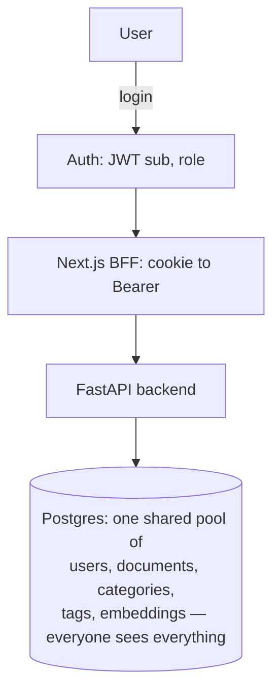
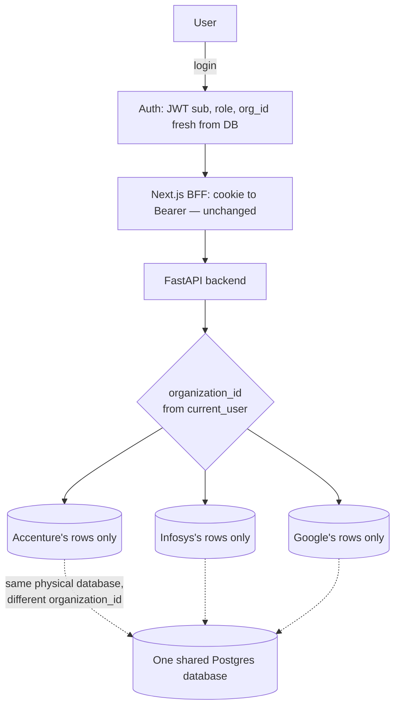

# DocBrain — Multi-Tenant Architecture Review (Single Tenant → Organization Workspace)

**Status:** Architecture review / design document. No implementation yet.
**Companion doc:** `docs/DOCBRAIN-ARCHITECTURE.md` (the original single-tenant design — this document assumes you've read it and does not repeat sections that don't change).
**Trigger:** Hackathon judge feedback — DocBrain should support multiple isolated organizations (e.g. Accenture, Infosys, Google, Microsoft), each with its own private workspace, the way Slack, Notion, or Google Workspace do.
**Guiding constraint:** Evolve, don't redesign. Every existing feature keeps working. All current data becomes the first organization, "Accenture."

---

## Executive Summary

DocBrain today is a **single shared workspace**: one `users` table, one `documents` table, one taxonomy, one dashboard — every signed-in user (regardless of role) can see every document in the system. There is no organization, tenant, or workspace concept anywhere in the code, schema, or JWT. This is not a partially-built multi-tenant system with gaps to close — it's a genuinely single-tenant system, so this is a **greenfield addition**, not a refactor of broken isolation logic.

The good news: the codebase's existing discipline (consistent router → service → repository layering, ports/adapters for storage and AI, additive-only schema evolution, no caching layer to invalidate) makes this a **clean, mechanical, well-bounded migration**. The core idea is the one every real multi-tenant SaaS product uses — Slack, Notion, Jira, Google Workspace all included — called **pooled multi-tenancy**: one database, one set of tables, and a `organization_id` column that silently rides along on every query, added by the backend, never trusted from the client.

The one place this needs real care is AI similarity search. Research into the codebase confirmed that `document_vector_embeddings` similarity search today has **zero scoping of any kind** — it is a pure nearest-neighbor search across every document in the database. Today that's safe because there's only one tenant. The moment a second organization exists, this single query becomes the highest-severity cross-tenant leak risk in the system if not fixed as part of the same migration. This review treats it as the top priority, not an afterthought.

---

# Part 1 — Understanding the Existing System

### Authentication & JWT
Login is real (argon2id password hashing, timing-attack resistant), invite-only — there's no public signup, only admins can invite. On successful login the backend (`backend/app/core/security.py`) mints a JWT with exactly four claims: `sub` (user ID), `role`, `iat`, `exp`. No org concept exists in the token today.

The JWT never reaches the browser's JavaScript. A Next.js "BFF" (Backend-for-Frontend) layer sets it as an `httpOnly` cookie, and every subsequent frontend request goes through `/api/bff/[...path]`, which reads that cookie server-side and translates it into an `Authorization: Bearer <token>` header before forwarding to FastAPI. This is a deliberate, already-documented security pattern (§10.2 of the architecture doc).

On the backend, `get_current_user` (`backend/app/core/dependencies.py`) verifies the JWT signature and then **re-fetches the full `User` row from the database on every single request**. This is important: it means role changes or account deactivation take effect immediately, without needing a token-blacklist. Role checks (`EMPLOYEE` / `REVIEWER` / `ADMIN`) are enforced via a `require_role(...)` FastAPI dependency on specific routes — the backend is the real authorization boundary; the frontend only hides UI for convenience.

### Users
One flat `users` table, one global `role` enum. No hierarchy, no grouping, no company/domain field. Admins invite new users (email + pre-assigned role) via a token-based invite flow that already has: token generation, hashing, expiry, a transactional email (Resend), and an unauthenticated "accept" endpoint that creates the account.

### Documents, Versions, Categories, Tags
Documents are the core entity: title, description, a required `category_id`, an `owner_id`, and a pointer to the current version. Every upload creates a `document_versions` row (immutable, append-only — restoring an old version creates a *new* version row rather than rewriting history). Categories and tags are flat, globally shared, admin-curated vocabularies with no owner concept at all today — everyone sees and uses the same list.

### Dashboard, Reviews, Trash
The dashboard aggregates totals, category breakdowns, recent/expiring documents, and an activity feed — nine-plus separate aggregate queries against the `documents`, `categories`, `document_versions`, and `activity_events` tables, all instance-wide today. Reviews is a queue of documents whose `review_due_date` is approaching. Trash is a soft-delete: `documents.status` flips to `DELETED` with a timestamp and actor; non-admins only see their own trashed documents, admins see everyone's — this is the one place in the whole domain layer that already has an ownership-based filter, and it's the template for how org filtering will look everywhere else.

### AI Metadata & Similar Documents
A background worker (not part of the request path) picks up jobs from a Postgres-backed queue table (`ai_jobs`) and calls Google Gemini to: extract text, generate a suggested title/summary/tags in one call, and generate a 768-dimension embedding stored in `document_vector_embeddings` with a pgvector HNSW cosine index. "Similar documents" is a live nearest-neighbor query over that index.

### Background Worker
A standalone Python process (`python -m app.ai_jobs.main`), separate from the API server, polling the same Postgres database every 15 seconds using `SELECT ... FOR UPDATE SKIP LOCKED` to safely claim jobs even with multiple worker instances running.

### Storage
A `StoragePort` abstraction with two implementations (local disk for tests, Supabase Storage / S3-compatible for production). File paths are structured as `documents/{document_id}/v{version_number}__{filename}` — scoped to the document, not to any user or tenant.

### Database
Supabase-hosted Postgres, accessed directly through SQLAlchemy (deliberately not through the Supabase client SDK, to keep all business rules in one layer), with Alembic migrations. No Redis, no application-level cache anywhere.

### Why this is Single-Tenant today
Every one of the above systems answers "show me X" with **all of X in the database**, filtered only by status/role/query-params the caller supplies — never by "which company does this belong to," because that question has no answer in the schema. One `users` table, one `documents` table, one taxonomy, one activity log, one vector index. That is the textbook definition of single-tenant: the isolation boundary that exists today is "this Postgres database," not "this organization."

---

# Part 2 — What Multi-Tenant SaaS Means (In Simple English)

A multi-tenant application serves many separate customers ("tenants") from one shared codebase and, usually, one shared database — while making each customer's data completely invisible to every other customer.

- **Slack**: each company gets a "workspace." Your messages, channels, and files never appear in another company's workspace, even though Slack runs one giant backend for everyone.
- **Notion**: each company/team has a "workspace" with its own pages, members, and permissions — invisible to other workspaces.
- **Jira / Atlassian**: each company has a "site" — its own projects, issues, and users.
- **Google Workspace**: each company has its own domain (e.g. `@accenture.com`) — its documents, mail, and calendars are walled off from every other company using Google Workspace.

In every one of these, the pattern is the same: **one product, one database, many isolated "rooms."** The room a user is in is decided the moment they log in, and every single thing they see afterward is automatically filtered to that room — the user never has to think about it, and critically, the *server* enforces it, not the client.

For DocBrain, that "room" is the **Organization**. Accenture's documents, categories, tags, AI suggestions, similar-document results, dashboard, activity, and trash all become their own room. Infosys gets a separate, empty room the day they sign up. Nothing is shared between rooms unless a future feature explicitly builds a bridge (there isn't one planned).

---

# Part 3 — Database Design

### The core principle

> **If a table is ever queried, listed, or aggregated on its own — not just fetched by a single already-known parent ID — it gets its own `organization_id` column, even when that value is technically derivable by joining up to a parent.**

This principle exists because of a real finding from this review: the AI similarity search (`document_vector_embeddings`) has no direct link to an owner at all — it can only be scoped by joining through `document_versions → documents`. That's exactly the shape of query most likely to be written without the join one day, which is exactly how a cross-tenant leak happens. Denormalizing `organization_id` onto tables that get queried independently — not just relying on FK chains — is the same tradeoff Slack, Notion, and virtually every pooled-multi-tenant SaaS makes: a little redundant data, in exchange for every query being trivially auditable ("does this WHERE clause filter on `organization_id`? yes/no") instead of "does this join chain eventually reach a tenant boundary?"

### Tables that need a direct `organization_id` column

| Table | Why |
|---|---|
| `users` | The account's home organization. Root of the whole tree — every other table's org membership ultimately traces back to a user. |
| `documents` | Core tenant content. Listing, searching, and dashboard queries all hit this table directly and constantly. |
| `categories` | Currently a single global list shared by everyone. Each org needs to define and name its own categories without colliding with (or seeing) another org's. |
| `tags` | Same reasoning as categories — currently a single global vocabulary with no owner at all. |
| `invitation` | An admin invites people *into their own organization*. The invite row must remember which org the invitee is joining. |
| `share_links` | Owner-facing create/list/revoke queries are listed independently ("show me all links I've sent"). Needs direct scoping even though the public redemption path doesn't need it (see Part 7). |
| `document_versions` | Version listing/download is a very hot path. Direct scoping avoids joining to `documents` on every single version query, and is defense-in-depth. |
| `activity_events` | The activity feed and dashboard query this table directly and heavily, independent of any single document. |
| `ai_jobs` | The background worker's queue. Needed for future per-org fairness (see Part 11) and as defense-in-depth on the exact kind of table where the embeddings leak was found. |
| `ai_document_analysis` | Same defense-in-depth reasoning as `ai_jobs`. |
| `document_vector_embeddings` | **Mandatory, not optional.** This is the proven leak point (Part 7). The similarity query must filter on this column directly — never rely on a join chain here. |

### Tables that do NOT need their own column (derive it from a parent instead)

| Table | Why it's safe to derive |
|---|---|
| `document_tags` | Pure join table between `documents` and `tags` — both parents are already org-scoped, and it's never listed or queried on its own. |
| `user_preferences` | One row per user, always looked up by `user_id` directly — never listed across users. |
| `password_reset_tokens` | Always resolved by a single unguessable token, never listed or filtered by organization. |
| `document_extracted_text` | One row per document version, always fetched by a known `document_version_id` — never queried independently. |

### Tables that will never need `organization_id`

`organizations` itself, obviously — it *is* the tenant. And, looking ahead (Part 12): if DocBrain ever adds a subscription-plan catalog ("Free / Pro / Enterprise" plan *definitions*, not any one org's subscription), that table is the textbook example of genuinely global reference data — every organization reads the same three rows. Nothing like that exists in the schema today, but it's worth naming so the principle is clear: global tables describe *the product*, tenant tables describe *a customer's use of the product*.

### Uniqueness constraints that must change

Two constraints are global today and must become per-organization:
- `categories`: case-insensitive unique name, and unique `slug` → both become `(organization_id, lower(name))` / `(organization_id, slug)`.
- `tags`: unique `normalized_name` → becomes `(organization_id, normalized_name)`.

Everything else (e.g. `(document_id, version_number)` on `document_versions`) is already scoped to a parent that will itself carry `organization_id`, so no change is needed there.

---

# Part 4 — Authentication Changes

### Current
```
Login → JWT { sub, role, iat, exp } → get_current_user (re-fetches User row every request) → role check
```

### Future
```
Login → JWT { sub, role, iat, exp, (optional) org_id } → get_current_user (re-fetches User row, including organization_id) → org check → role check within that org
```

### What actually needs to change — and what's already right

The most important discovery in this review: **`get_current_user` already re-fetches the entire `User` row from the database on every request** — that's how role changes and deactivation take effect immediately without a token blacklist. This means the *same* mechanism, with zero new plumbing, already gives every request an authoritative, always-fresh `current_user.organization_id`. **The JWT does not strictly need to change at all** to make organization scoping work — the backend can simply read `current_user.organization_id` off the row it's already fetching.

Adding `org_id` (and maybe an org display name) to the JWT payload anyway is still a good, cheap, purely additive idea — it lets the frontend show "You're in Accenture's workspace" without an extra API round-trip. The rule to keep, though: **the JWT claim is a convenience for display only. Every authorization decision uses `current_user.organization_id` freshly read from the database**, the same posture already used for `role`. This is consistent with the existing security philosophy in this codebase, not a new one.

### One user, one organization (recommended for this phase)

Slack technically allows one identity to belong to multiple workspaces and switch between them. That's real added complexity — a workspace-switcher UI, a join table (`user_organizations`), a "currently active org" concept in the session. Given the brief ("each org is a completely separate company — Accenture, Infosys, Google, Microsoft") and the goal of *evolving* rather than redesigning, this review recommends the simpler model: **each user belongs to exactly one organization**, matching how the existing invite-only signup already works (an admin invites *someone into their own company*). A `users.organization_id` foreign key, not a join table. Multi-org membership can be a clean future add-on later — it doesn't block anything in this plan.

### What remains unchanged
- Password hashing, login endpoint shape, token expiry/refresh behavior, the "any request instantly reflects deactivation/role changes" property.
- `require_role(...)` role-gating — unchanged in mechanism; it now simply also implies "within the caller's own org" everywhere role and org checks are combined.

### BFF
No changes needed. The BFF's only job is cookie → Bearer header translation; it has never inspected token contents and doesn't need to start now. Organization scoping is entirely a backend (FastAPI) responsibility.

### Authorization
Every `require_role(...)`-gated action continues to work exactly as today, but now implicitly means "this role, in this org." An `ADMIN` at Accenture manages Accenture's users, categories, and reviews only — never Infosys's. Because of the one-user-one-org model, this falls out for free: an Accenture admin's queries are already filtered to Accenture by the same `organization_id` predicate every other query gets.

---

# Part 5 — Request Flow

In simple terms: the organization is decided exactly once, at login, and after that it silently rides along on every request without anyone having to think about it again.

```
Login
  ↓
JWT issued (identity)
  ↓
Every request: BFF forwards cookie as Bearer token (unchanged)
  ↓
Backend: get_current_user re-fetches the User row (unchanged mechanism)
  ↓
current_user.organization_id is now available to the request
  ↓
Service layer passes organization_id into every repository call
  ↓
Repository layer adds `WHERE organization_id = :org_id` to every query
  ↓
Only that organization's rows are ever returned
```

The client (browser) never sends an organization ID, never chooses one, and can't override one — it is derived server-side from the authenticated user's own row every single time. This is the same "never trust the client for security-relevant scoping" rule already used for `role`.

---

# Part 6 — Impact Analysis, Module by Module

| Module | Change required | Complexity | Breaking? | Risk |
|---|---|---|---|---|
| **Authentication** | `current_user.organization_id` becomes available; optional JWT claim addition | Low | Non-breaking | Low — mechanism already exists (Part 4) |
| **Users / Admin** | Every user-management query and `require_role` flow scoped to org; invite creation stamps `organization_id` from the inviting admin | Medium | Non-breaking (additive filter) | Low |
| **Documents** | `list_documents`, `get_active_by_id`, `get_any_by_id`, `list_trash` all need an org filter added | Medium | Breaking in behavior (any-doc-by-id currently has *no* ownership check at all — see note below), not in API shape | **Medium-High** — this is also where the "any authenticated user can view any document by ID" gap needs closing (see below) |
| **Versions** | List/get/upload/restore queries scoped via the document's org | Low-Medium | Non-breaking | Low — versions already route through the documents module's checks |
| **Categories / Tags** | Needs a real schema change (new `organization_id` column, since none exists today) plus new composite uniqueness constraints and every query re-scoped | Medium | Non-breaking to the API; each org starts with its own empty or duplicated taxonomy | Low-Medium |
| **Reviews** | `list_pending` needs an org filter | Low | Non-breaking | Low |
| **Dashboard** | Every one of its 9+ aggregate queries needs the same filter added — the single largest number of individual query sites to touch | Medium (mechanical, not conceptually hard) | Non-breaking | Low, but easy to miss one metric — needs a checklist during implementation |
| **Activity** | `activity_events` queries and writes scoped to org | Low | Non-breaking | Low |
| **Storage** | No structural change needed; file paths stay `documents/{id}/...` since access is always authorized through the DB layer first, never by path pattern | None | Non-breaking | Low |
| **Background Worker** | `ai_jobs` gains `organization_id` for future fairness; claim/process logic itself doesn't need to change (a job already always resolves to one document, hence one org) | Low | Non-breaking | Low |
| **AI Metadata (Smart Rename / Tags / Summary)** | No logic change — these operate on one document at a time and never compare across documents, so they were never at risk | None | Non-breaking | None |
| **Similarity Detection / Embeddings** | **Must add an explicit `organization_id` filter to the nearest-neighbor query.** This is the one place with real, proven risk. | Low (the fix itself is a one-line filter addition) but **high importance** | Non-breaking to the API; changes *which results* come back (correctly) | **High if skipped**, low once fixed |
| **Future RAG / Chat** | Not built yet — design it org-scoped from day one (see Part 7) | N/A (greenfield) | N/A | Low — nothing to break yet |
| **Notifications** | Not built yet — design it org-scoped from day one | N/A | N/A | Low |
| **Settings** | Per-user settings already scoped to the user; unaffected. Future org-level settings (Part 12) are purely additive | None today | Non-breaking | None |

**Documents note (elaborated):** research into `documents/service.py` found that `get_detail()` — the function behind viewing any document by ID — currently has **no ownership check of any kind**, by design, because today "any signed-in user can see any document" *is* the intended single-workspace behavior. Once organizations exist, this must become the **first** thing gated: fetching a document by ID must also check `document.organization_id == current_user.organization_id` (return 404, not 403, to avoid confirming another org's document even exists). Every other endpoint that calls `get_detail()` — including the similarity endpoint — automatically inherits this fix once it's made in one place.

---

# Part 7 — AI Features Becoming Organization-Aware

This is the most safety-critical part of the whole migration, so it gets its own detailed walkthrough.

### The finding

The similarity search query (`DocumentVectorEmbeddingRepository.find_similar`) currently filters on exactly three things: the embedding succeeded, the document is active, and it isn't the source document itself. **That's it — no owner, no user, no organization anywhere in the query.** It is a flat nearest-neighbor search across the pgvector HNSW index covering every document in the entire database. Today, that's harmless, because there is only one organization's data in the database. The instant a second organization's documents are embedded into the same index, Accenture's "similar documents" results could include Infosys's document titles and content — a direct cross-tenant data leak, and arguably the single most damaging possible bug in this whole migration, since it would surface another company's private information inside a feature that looks completely normal to the end user.

### How each AI feature becomes organization-aware

- **Smart Rename / Auto Tags / Summary** — no change needed. These features look at exactly one document's extracted text and call Gemini once. There is no cross-document comparison, so there's no cross-tenant surface here at all.
- **Embeddings generation** — no change needed to *generation* (it's per-document, same as above). The embedding itself doesn't need to "know" its org differently than the document it belongs to.
- **Similarity Detection** — **must change.** Add `organization_id` directly to `document_vector_embeddings` (Part 3), and add `Document.organization_id == source_document.organization_id` to the `find_similar` query's `WHERE` clause. Because the source document was already fetched through the now-org-checked `get_detail()` (Part 6), the source's org is trustworthy, and filtering the candidate pool to that same org guarantees the vector search physically cannot return another org's document.
- **Duplicate Detection (planned, not built)** — explicitly designed to reuse `SimilarityService` as-is, so it inherits the fix above automatically once built. No separate design needed.
- **Future Chat / RAG / Vector Search** — not built yet, which is good: it should be designed org-scoped from its very first line of code, using the same pattern (every retrieval query filters on the caller's `organization_id`, never trusts a document ID alone). Because this doesn't exist yet, there's no migration risk here — just a rule to follow when it's eventually built.

### How to guarantee the AI never compares across organizations

Two layers, not one:
1. **Query-level filter (primary):** every AI retrieval query — similarity today, RAG/chat tomorrow — filters candidates by `organization_id` before it filters by anything else (score, recency, etc.). This is the same discipline as every other module.
2. **Background worker (secondary, informational only):** the worker never needs to *decide* organization membership — it always operates on one `document_version_id` at a time, which already belongs to one document, which belongs to one org. There's nothing for the worker to get wrong here as long as it doesn't do its own cross-document comparisons (it doesn't today, and shouldn't in the future either).

The practical takeaway for implementation later: **grep for every place `document_vector_embeddings` or `ai_document_analysis` is queried, and confirm each one either joins through an org-scoped document or filters on the new direct `organization_id` column.** That one audit step is the entire safety net for this part of the system.

---

# Part 8 — Confirming Existing Features Keep Working

Because the only change is *adding a filter that narrows results to "your organization"* — and today there's exactly one organization in the system — every existing feature's behavior for Accenture's own users is provably unchanged the moment the migration is complete and Accenture is the only tenant. Nothing about *how* upload, download, preview, search, review, trash, restore, or admin actions work needs to change — only *which rows are visible* changes, and for the only organization that exists on day one, that answer is "the same rows as before."

| Feature | Why it keeps working |
|---|---|
| Upload / Download / Preview | Storage paths and version records are unaffected — org scoping happens at the database query layer before storage is ever touched, not in the storage layer itself. |
| Search | The existing `tsvector` full-text search index is untouched; it simply gains one more `WHERE` predicate, exactly like the existing `status = ACTIVE` predicate it already has. |
| Dashboard | Same aggregate logic, same 9 queries — each just adds one more filter. Numbers for Accenture stay identical because Accenture is still the only org. |
| Reviews / Trash / Restore | Same ownership-aware logic that already exists (trash already has an owner-vs-admin distinction, Part 1) — org scoping layers on top the same way role already does. |
| Version Upload / Version Restore | Unaffected — versions are always reached through an already-org-checked document. |
| Admin / Role Permissions | Unchanged in mechanism; now implicitly means "within your org," which for Accenture-only data is the same set of people as today. |
| AI Metadata | Unaffected (Part 7) — never had a cross-document surface to begin with. |
| Background Worker | Unaffected — it processes one job/document/version at a time regardless of how many organizations exist. |

The one deliberate, *intentional* behavior change is the similarity search fix (Part 7) and the "any document viewable by ID" gap closing (Part 6) — both of these are described as bugs relative to the multi-tenant goal, not regressions relative to the single-tenant goal, and both are strictly necessary for the isolation guarantee the judge asked for.

---

# Part 9 — Data Migration Plan

Each step is additive and independently reversible until Step 7, which is the one step where query *behavior* actually changes.

**Step 1 — Create the `organizations` table.**
`id`, `name`, `slug`, `created_at`, plus room to grow (nullable `logo_url`, `settings` JSON — Part 12). Zero risk: nothing references it yet.

**Step 2 — Insert the default organization, "Accenture."**
One row, with a known fixed ID used consistently by every later step. Zero risk: a single insert.

**Step 3 — Add `organization_id` columns, nullable, to every table identified in Part 3.**
No default query anywhere reads this column yet, so the application behaves identically before and after this step. Zero behavior risk — purely additive schema change, matching the codebase's existing "additive-only schema evolution" principle (already documented practice, per the project's own architectural principles).

**Step 4 — Backfill.**
For every table from Step 3, `UPDATE ... SET organization_id = <Accenture's id> WHERE organization_id IS NULL`. Every existing user, document, version, category, tag, activity event, AI record, and embedding becomes Accenture's. Run inside a transaction per table; verify row counts match before/after.

**Step 5 — Add `NOT NULL` constraints, foreign keys, and indexes.**
Now that every row is backfilled, lock the column down. Add `organization_id` as the *leading* column in the composite indexes that matter most for query speed (e.g. alongside the existing `(status, updated_at)`-style indexes on `documents`) — this mirrors an indexing pattern already used elsewhere in this schema. Update the two uniqueness constraints on `categories`/`tags` to be per-organization (Part 3).

**Step 6 — Update the authorization layer.**
`current_user.organization_id` becomes available (Part 4). Optionally add the claim to the JWT. No query behavior changes yet — this step only makes the value available.

**Step 7 — Update every repository method to filter by `organization_id`.**
This is the one behavior-changing step, done module by module using the checklist in Part 6: documents, versions, taxonomy, reviews, dashboard, shares, and — highest priority — the AI similarity query (Part 7). Recommend introducing one small shared base-repository pattern that all tenant-scoped repositories use, so every filter looks the same and is easy to review/audit in one pass, consistent with the existing consistent-layering style already used across every module.

**Step 8 — Test.**
Full existing backend suite (178 tests) must keep passing unmodified — proving nothing broke for Accenture. Then add new cross-tenant isolation tests: create a second test organization with its own document, and assert every list/get/search/dashboard/similarity endpoint returns zero results and 404s for it from Accenture's session, and vice versa. This is entirely new test coverage — nothing like it exists today, since there's never been a second tenant to test against.

---

# Part 10 — Security: How Org A Never Sees Org B's Data

In simple terms: **the same discipline currently used to stop one employee from doing admin actions is reused to stop one organization from ever seeing another's data — just one more filter, checked in the same place, the same way, every time.**

- **Backend filtering (the real boundary):** every query that returns tenant data adds `WHERE organization_id = :org_id`, where `:org_id` always comes from the freshly-fetched `current_user` row — never from anything the client sends. This is the same pattern already used for `role`, extended by one column.
- **Authorization:** `require_role(...)` continues to gate *what* a role can do; the new org filter independently gates *whose* data it can do it to. Both checks apply together, the same way they already compose today (e.g. an admin can manage users, but only ever *their own org's* users going forward).
- **Repository layer:** this is where enforcement physically lives — not scattered across routers or services, consistent with how the codebase already keeps query logic in repositories. A single shared base pattern (Part 9, Step 7) makes it possible to verify, by inspection, that every tenant-scoped repository method includes the filter.
- **API protection:** document-by-ID lookups (and everything built on them, including similarity) start returning 404 for another org's document ID, rather than the data — this closes the one real gap found in this review (Part 6).
- **AI isolation:** covered in depth in Part 7 — the vector similarity query gets the same filter as everything else, closing the one proven leak risk.
- **Defense in depth (optional, worth considering later, not required for launch):** because DocBrain already runs on Supabase Postgres, Postgres **Row-Level Security (RLS)** could be layered on as a second, independent safety net — a database-enforced rule that a session can only ever see rows matching its `organization_id`, even if an application bug forgot the filter. This isn't required for the initial migration (the application-layer filtering above is sufficient and matches how the rest of this codebase already enforces rules), but it's a strong option to revisit once there are real paying customers, precisely *because* it would have caught the kind of "forgot to join" mistake that caused the current similarity-search gap.

---

# Part 11 — Scalability

| Scale | Verdict | Notes |
|---|---|---|
| **10 organizations** | Works with zero changes beyond this migration. | Trivial data volume; existing indexing patterns are more than enough. |
| **100 organizations** | Works with zero changes beyond this migration. | Same as above — the `organization_id`-led composite indexes handle this comfortably. |
| **1,000 organizations** | Works, assuming the indexing from Part 9/Step 5 is done properly. | The dashboard's already-known "21 sequential queries" performance issue (documented separately as existing tech debt, unrelated to this migration) becomes more noticeable per-org at this scale — worth revisiting, but it's a pre-existing item, not something this migration causes or must fix. |
| **100,000 organizations** | Needs real follow-up work — but nothing about this migration blocks getting there later. | At true enterprise scale: (a) the shared `ai_jobs` queue has no per-org fairness today — a very large org uploading thousands of documents could slow down small orgs' AI processing; a per-org rate limit or weighted scheduling would be needed. (b) One shared pgvector HNSW index holding every org's embeddings can start to show both performance and blast-radius concerns at extreme scale; options at that point include per-org index partitioning or read replicas. (c) Standard Postgres scaling tools — connection pooling, read replicas, and possibly Postgres table partitioning by `organization_id` on the largest tables (`documents`, `activity_events`) — become worth evaluating. None of this requires redesigning the schema; it's additive infrastructure work layered on top of the same `organization_id` column this migration introduces. |

The short version: **the pooled multi-tenancy model recommended here (one database, one `organization_id` column) is the correct choice at every scale this product is realistically going to hit in the foreseeable future** — it's the same model Slack and Notion both started on. The 100,000-org tier is a "nice problem to have" that can be solved later without touching this migration's design.

---

# Part 12 — Future Features This Naturally Supports

The `organizations` table becomes a natural home for all of the following — each one is additive (new nullable columns or new small tables), none require touching the isolation logic built in this migration:

- **Organization Settings / Logo / Branding** — add `settings` (JSON) and `logo_url` columns directly to `organizations`.
- **Invite Users / Email Invitations** — **already fully built.** The existing invitation system (token generation, hashing, expiry, transactional email via Resend, unauthenticated accept flow) only needs one change: stamp the inviting admin's `organization_id` onto the `Invitation` row, and carry it onto the created `User` at accept time. This is close to the smallest possible change in the entire migration relative to the value it unlocks.
- **Billing / Subscription Plans / Storage Quotas** — add `plan`, `seat_limit`, `storage_quota_bytes` (etc.) columns to `organizations`; usage aggregation can reuse the same aggregate-query pattern the dashboard already uses, just rolled up per org.
- **Organization Admin** — falls out for free from the existing `ADMIN` role once it's implicitly scoped to "admin of my org" (Part 4) — no new role concept needed.
- **SSO / Azure AD / Google / Microsoft Login** — the one genuinely new piece of work among these. Password login stays exactly as it is today; SSO is an *additional* login path, likely backed by a new small `organization_sso_providers`-style table (or a `sso_config` JSON column on `organizations`) mapping an org to its identity provider. Because it's an alternate path alongside the existing one, it doesn't touch anything built in this migration.

---

# Part 13 — Risks and Mitigations

| Risk | Mitigation |
|---|---|
| **Database:** this migration is exactly the kind of high-stakes schema change that makes the already-known, already-deferred "local and production share one database" issue (documented separately as an existing high-risk open item, and the cause of a recent real production incident) more dangerous than usual. | Strongly recommend resolving the dev/prod database split *before or alongside* this migration, not after — running an 8-step schema migration with `NOT NULL` constraints against a database that local development also writes to is the highest-probability way for this specific project to have an incident. |
| **JWT:** if `org_id` is added as a claim, tokens issued before the migration won't have it. | Non-issue in practice: `organization_id` is read from the freshly-fetched `current_user` row (Part 4), never trusted from the token, so old tokens keep working through the migration with no forced logout required. |
| **Permissions:** risk of a role accidentally meaning "admin of everything" instead of "admin of my org." | Avoided structurally by the one-user-one-org model (Part 4) — there is no code path where a role check isn't already implicitly scoped to the user's single org. |
| **AI:** the similarity search leak (Part 7). | Treated as the top-priority fix in this plan, with an explicit query-level filter and a stated audit step (grep every embeddings/analysis query) before considering the migration complete. |
| **Caching:** stale cross-org data served from a cache. | Not a risk here — this codebase has no caching layer today (confirmed during this review), so there's nothing to invalidate. Worth remembering if a cache is added later: it must be keyed by `organization_id`, not just by document ID. |
| **Background Worker:** noisy-neighbor risk (one org's job volume slowing down another's). | Low severity at current scale (Part 11); flagged as a Part-11-scale follow-up, not a blocker for this migration. |
| **Search:** the existing full-text index. | No new risk — it gains the same one filter every other document query gains; the underlying GIN index is untouched. |
| **Performance:** adding a `WHERE organization_id = ...` to every query. | Cheap, provided `organization_id` leads the relevant composite indexes (Part 9, Step 5) — this is a well-understood, low-risk indexing change, not a redesign. |

---

# Part 14 — Recommended Architecture

**Current:**


**Future:**


The important detail in the "future" diagram: Accenture, Infosys, and Google are drawn as separate boxes for clarity, but they live in the **same physical database and the same tables** — the separation is entirely logical, enforced by the `organization_id` filter on every query. This is what "pooled multi-tenancy" means, and it's the same model used by every real-world example named in this document.

---

# Part 15 — Implementation Roadmap

### Phase 1 — Organizations
- **Goal:** Introduce the `organizations` table and seed "Accenture" without touching any existing behavior.
- **Tasks:** Create table (Part 9, Step 1), insert default org (Step 2).
- **Validation:** Existing test suite passes unmodified (nothing references the new table yet).
- **Rollback:** Drop the table. Nothing depends on it yet — zero risk.

### Phase 2 — Migration (schema + backfill)
- **Goal:** Every existing row gets an `organization_id`, without any query yet using it.
- **Tasks:** Add nullable columns to every table from Part 3 (Step 3), backfill to Accenture's ID (Step 4).
- **Validation:** Row counts match pre/post backfill for every table; existing test suite still passes unmodified (columns exist but nothing reads them).
- **Rollback:** Drop the new columns. Zero risk — application code hasn't changed.

### Phase 3 — Authentication
- **Goal:** Make `organization_id` available to every authenticated request.
- **Tasks:** `NOT NULL` + indexes + composite uniqueness on `categories`/`tags` (Part 9, Step 5); wire `current_user.organization_id` through (Step 6); optionally add the JWT claim.
- **Validation:** Login/session tests pass; confirm role-change-takes-effect-immediately behavior still holds (it does — same mechanism, Part 4).
- **Rollback:** Revert the auth-layer changes; the schema changes from this phase are safe to leave in place since nothing queries by `organization_id` yet.

### Phase 4 — Repositories (the core isolation sweep)
- **Goal:** Every query in every module filters by `organization_id`. This is the one phase where behavior actually changes.
- **Tasks:** Module-by-module sweep per the Part 6 checklist, in priority order: (1) AI similarity query — highest risk, fix first and validate in isolation; (2) documents `get_detail`/list/trash — closes the "any document viewable by ID" gap; (3) versions; (4) taxonomy; (5) reviews; (6) dashboard (largest number of individual sites, lowest individual risk); (7) shares (owner-facing routes only).
- **Validation:** Full existing suite passes; new cross-tenant isolation tests (Part 9, Step 8) pass — this is the phase's real acceptance criteria, not just "old tests still green."
- **Rollback:** Because there is currently only one real organization in production, the practical blast radius of a mistake here is unusually low — a missed filter means Accenture sees Accenture's own data plus nothing (there's no second org's data to leak yet). Still, recommend deploying this phase as its own reviewable change, separate from Phase 5's `NOT NULL`/constraint hardening, so it can be reverted independently if a query regression is found.

### Phase 5 — Frontend
- **Goal:** Surface the organization concept in the UI (org name/logo in the header, admin screens scoped to "my org").
- **Tasks:** Mostly cosmetic, since the backend already enforces everything by Phase 4 — this phase is about UX polish, not security.
- **Validation:** Manual walkthrough of every existing screen with the second test organization created in Phase 4's tests, confirming nothing cross-org ever renders.
- **Rollback:** Purely additive UI changes — trivial to revert.

### Phase 6 — Testing
- **Goal:** Prove isolation holds under realistic conditions before creating a second real organization.
- **Tasks:** Formalize the cross-tenant isolation test suite as a permanent addition to the 178-test backend suite (not a one-off migration check); manually exercise the similarity-search fix with two real seeded organizations.
- **Validation:** This phase's own output *is* the validation — a passing isolation suite is the signal that the migration is genuinely done, not just deployed.
- **Rollback:** N/A — this phase only adds tests.

---

# Part 16 — Final Recommendation

✅ **What should remain unchanged:** the layered router → service → repository architecture, the ports/adapters pattern for storage and AI, the JWT mechanism and re-fetch-on-every-request auth model, the BFF cookie-to-Bearer proxy, the append-only version history, the existing invite flow's shape, and every current API's request/response contract.

✅ **What should change:** add one `organizations` table and one `organization_id` column (denormalized directly, not just derivable via joins) across the tables identified in Part 3; make every repository query filter on it; close the "any document viewable by ID" gap; add the one missing filter to the AI similarity query; migrate categories/tags from global to per-org vocabularies.

✅ **What to avoid:** don't build multi-org-per-user membership/workspace-switching yet — it's real added complexity the current brief doesn't ask for, and it doesn't block adding it later. Don't rely on join-chains alone for tenant scoping on tables that get queried independently — that exact pattern is what created the AI similarity risk in the first place. Don't skip building the cross-tenant isolation test suite — it's the only way to actually prove, rather than assume, that the isolation guarantee holds.

✅ **Recommended implementation order:** Phases 1 → 6 as laid out in Part 15, with the AI similarity fix and the document-by-ID ownership check treated as the highest-priority items inside Phase 4, not deferred to "later." Strongly recommend resolving the existing dev/prod database-split issue before running Phase 2's backfill in production, given it's both a documented existing risk and directly relevant to running schema migrations safely.

✅ **Overall architectural verdict:** DocBrain's existing discipline — consistent layering, additive-only schema changes, ports for swappable infrastructure, no caching to complicate invalidation — makes this an unusually clean multi-tenant migration as these things go. The design recommended here (pooled multi-tenancy, one `organization_id` column, backend-enforced filtering, denormalized onto independently-queried tables) is the same proven model used by Slack, Notion, Jira, and Google Workspace, sized correctly for where DocBrain is today and scalable without a redesign well past 1,000 organizations. The single most important engineering takeaway from this review is narrow and concrete: **the AI similarity search must be fixed as part of this migration, not after it** — everything else here is mechanical, well-understood work.
